# Introduction to RainAttr

``` r

library(RainAttr)
```

## Using RainAttr for Attribution and SATE Analysis: Oman Data Example

This package estimates and performs inference on the **attribution**,
defined as the percentage increase in raw-scale rainfall attributable to
the ionization technology, and **sample average treatment effect
(SATE)** for gauge-day level rainfall enhancement trial data. An example
of a gauge-day level dataset is given below:

``` r

head(oman)
#>   Year YearDay Month TrialDay Year...2013 Year...2014 Year...2015 Year...2016
#> 1 2013     135     5  2013135           1           0           0           0
#> 2 2013     135     5  2013135           1           0           0           0
#> 3 2013     135     5  2013135           1           0           0           0
#> 4 2013     135     5  2013135           1           0           0           0
#> 5 2013     135     5  2013135           1           0           0           0
#> 6 2013     135     5  2013135           1           0           0           0
#>   Year...2017 Year...2018 H1on H2on H3on H4on H5on H6on H7on H8on H9on H10on
#> 1           0           0    1    0   NA   NA   NA   NA   NA   NA   NA    NA
#> 2           0           0    1    0   NA   NA   NA   NA   NA   NA   NA    NA
#> 3           0           0    1    0   NA   NA   NA   NA   NA   NA   NA    NA
#> 4           0           0    1    0   NA   NA   NA   NA   NA   NA   NA    NA
#> 5           0           0    1    0   NA   NA   NA   NA   NA   NA   NA    NA
#> 6           0           0    1    0   NA   NA   NA   NA   NA   NA   NA    NA
#>   Gauge.ID Gauge.Latitude Gauge.Longitude Gauge.Elevation Elevated.Gauge
#> 1        1       22.79050        57.85393           0.479              0
#> 2        2       22.84042        57.87990           0.540              0
#> 3        3       22.87118        57.76013           0.495              0
#> 4        4       22.78372        57.74142           0.439              0
#> 5        5       22.81430        57.59140           0.445              0
#> 6        6       22.90993        57.59237           0.508              0
#>   Gauge.Elevation...1km Gauge.Elevation...1km.1 Rain.Gauge.Measurement
#> 1                 0.479                       0                      0
#> 2                 0.540                       0                      0
#> 3                 0.495                       0                      0
#> 4                 0.439                       0                      0
#> 5                 0.445                       0                      0
#> 6                 0.508                       0                      0
#>   Rainfall.Event Positive.Rainfall LogRain Rainfall.Measurement.Status
#> 1              0                NA      NA                    Downwind
#> 2              0                NA      NA                    Downwind
#> 3              0                NA      NA                    Downwind
#> 4              0                NA      NA                    Downwind
#> 5              0                NA      NA                    Downwind
#> 6              0                NA      NA                    Downwind
#>   Target.H.01 Target.H.02 Target.H.03 Target.H.04 Target.H.05 Target.H.06
#> 1           0           0           0           0           0           0
#> 2           0           0           0           0           0           0
#> 3           0           0           0           0           0           0
#> 4           0           0           0           0           0           0
#> 5           1           0           0           0           0           0
#> 6           1           0           0           0           0           0
#>   Target.H.07 Target.H.08 Target.H.09 Target.H.10 Gauge.Day.Type
#> 1           0           0           0           0        Control
#> 2           0           0           0           0        Control
#> 3           0           0           0           0        Control
#> 4           0           0           0           0        Control
#> 5           0           0           0           0         Target
#> 6           0           0           0           0         Target
#>   Steering.Wind.Direction Steering.Wind.Principal.Direction Steering.Wind.Speed
#> 1                     325                               NNW            6.687778
#> 2                     325                               NNW            6.687778
#> 3                     325                               NNW            6.687778
#> 4                     325                               NNW            6.687778
#> 5                     325                               NNW            6.687778
#> 6                     325                               NNW            6.687778
#>   Lifted.Index Total.Totals LCL.Pressure Precipitable.Water PC1.Dry.Temperature
#> 1         8.03         34.6       607.24              15.77            1.089538
#> 2         8.03         34.6       607.24              15.77            1.089538
#> 3         8.03         34.6       607.24              15.77            1.089538
#> 4         8.03         34.6       607.24              15.77            1.089538
#> 5         8.03         34.6       607.24              15.77            1.089538
#> 6         8.03         34.6       607.24              15.77            1.089538
#>   PC2.Dry.Temperature PC1.Relative.Humidity PC2..Relative.Humidity
#> 1            3.045836             -2.183532              -2.494393
#> 2            3.045836             -2.183532              -2.494393
#> 3            3.045836             -2.183532              -2.494393
#> 4            3.045836             -2.183532              -2.494393
#> 5            3.045836             -2.183532              -2.494393
#> 6            3.045836             -2.183532              -2.494393
#>   PC1.Ground.Level.Pressure
#> 1                 0.4760997
#> 2                 0.4760997
#> 3                 0.4760997
#> 4                 0.4760997
#> 5                 0.4760997
#> 6                 0.4760997
```

The `Gauge.Day.Type` column classifies each observation into one of the
following types:

- Upwind: gauges located upwind of ionizers
- Target: gauges located downwind of at least one active ionizers
- Control: gauges located downwind of inactive ionizers
- Out of Scope: gauges that are neither upwind, target, nor control

### rain_attr() - Main Function

We examine the effectiveness of the ionization technology used in the
Oman 2013-2018 trial, based on the two-stage linear mixed model (LMM)
approach employed in Chambers, Beare, et al. (2022). This is achieved by
using the main function `rain_attr` from the package:

``` r

result = rain_attr(
  #gauge-day level trial data
  data = oman,

  #LMM formula fitted to the upwind (first-stage) observations
  upwind_lmm_formula = LogRain ~  Gauge.Elevation + Steering.Wind.Speed + Total.Totals + PC2.Dry.Temperature + PC1.Relative.Humidity + PC1.Ground.Level.Pressure + (1|TrialDay),

  #Variable name for storing instrumental prediction from upwind (first-stage) LMM
  instr_pred_name = 'natural_pred',

  #Types of instrumental prediction: 'Unconditional' or 'Conditional'
  instr_pred_type = 'Conditional',

  #LMM formula fitted to the downwind (second-stage) observations
  downwind_lmm_formula = LogRain - natural_pred ~ Gauge.Elevation  + Target.H.01 + Target.H.02 + Target.H.03 + Target.H.04 + Target.H.05 + Target.H.06 + Target.H.07 + Target.H.08 + Target.H.09 + Target.H.10 + Gauge.Elevation:Target.H.01 + Gauge.Elevation:Target.H.02 + (1|TrialDay),

  #Formula for fitting a logistic regression model to the indicator of rainfall event (used for bootstrapping of rainfall events)
  downwind_logistic_formula = NULL,

  #Formula for fitting the propensity score model to downwind observations, where responses are indicators of whether each downwind observations is a 'Target'
  downwind_propensity_formula = (Gauge.Day.Type == 'Target') ~ Total.Totals + PC1.Dry.Temperature + PC1.Relative.Humidity + PC1.Ground.Level.Pressure,

  #Specify the column in input data that contains the raw rainfall
  rain_col_name = 'Rain.Gauge.Measurement',

  #Logical expression identifying subset of observations to which upwind_lmm_formula is fitted
  upwind_subset = Gauge.Day.Type == 'Upwind',

  #Logical expression identifying subset of observations to which downwind_lmm_formula is fitted
  downwind_subset = Gauge.Day.Type  %in% c('Target','Control'),

  #Logical expression identifying subset of observations of those that are 'Target'
  downwind_target_subset = Gauge.Day.Type == 'Target',

  #Logical expression identifying subset of observations of those that are 'Control'
  downwind_control_subset = Gauge.Day.Type == 'Control',

  #Logical expression identifying subset of observations with rainfall event
  positive_subset = Rain.Gauge.Measurement > 0,
  
  #Types of correction (for back-transformation bias) used for computing the attribution estimate: 'ChambersEtAl', 'ChambersEtAl_No_Winsorize', 'ThoEtAl', or 'No'
  attr_type = 'ThoEtAl',

  #Vector of variable names in downwind_lmm_formula to identify non-ionizer related covariates, whose effects are not included in the calculation of attribution and SATE
  x_downwind_name = c('Gauge.Elevation')
  )
```

The `rain_attr` function fits two LMMs sequentially:

1.  An upwind (first-stage) LMM fitted using
    `lme4::lmer(upwind_lmm_formula)` to
    `data[upwind_subset & positive_subset,]` .
    1.  Obtain fitted values (named as `instr_pred_name`) for
        `data[downwind_subset & positive_subset,]`, where the fitted
        values are conditional or unconditional depending on
        \`instr_pred_type’.
2.  A downwind (second-stage) LMM fitted using
    `lme4::lmer(downwind_lmm_formula)` to
    `data[downwind_subset & positive_subset,]`.

The estimated LMM model parameters are then used to calculate
attribution and SATE estimates, where `attr_type` specifies the type of
correction for back-transformation bias in computing the attribution
estimates, and `x_downwind_name` identifies non-ionizer related
covariates, whose effects are excluded from the calculation of these
estimates.

Moreover, a logistic propensity score model is also fitted using
`glm(downwind_propensity_formula, family = "binomial")` to
`data[downwind_subset & positive_subset,]` with the response being the
binary indicator for whether each observation is exposed to the ionizer
(i.e., a target observation). This fitted model, along with the
arguments specified via `downwind_target_subset` and
`downwind_control_subset`, facilitate the estimation of SATEs.

While different options can be specified via the arguments of
[`rain_attr()`](https://zy1225.github.io/RainAttr/reference/rain_attr.md),
the above example illustrates our recommended options:

- `instr_pred_type = 'Conditional'`: uses the conditional fitted values
  from the upwind (first-stage) LMM
- `downwind_lmm_formula = LogRain - natural_pred ~ ...`: incorporates
  the conditional fitted values as an offset term
- `attr_type = 'ThoEtAl'`: attribution estimation is based on an
  adjustment proposed by Tho et al. (2026) to account for the
  back-transformation bias arising from the modelling of log-transformed
  rainfall
- `target_only = FALSE` (the default option, and hence not explicitly
  specified above): attribution estimates are computed using both
  treated (exposed to operating ionizers) and control (not exposed)
  observations.

### Object Returned by rain_attr()

The `rain_attr` function returns an S3 object of class `rain_attr`,
which can be called to print the main results associated with the
attribution and SATEs. Some basic information related to the estimated
upwind (first-stage) and downwind (second-stage) models are also
printed, such as the number of observations and the estimated fixed
effects.

``` r

result
#> Two Stage LMM Rainfall Enhancement Analysis Result
#> ======================================================================
#> 
#> Point Estimates:
#> Attribution (%) Assuming Log-Rainfall being Modelled:
#>   apo   apl 
#> 6.27% 6.69% 
#> 
#> SATE Estimates (hatsate):
#>     sate.mb    sate.ipw  sate.ipw.l sate.ipw.ma   sate.aipw 
#>     0.11531     0.07513     0.11324     0.08135     0.07706 
#> ======================================================================
#> 
#> Inference:
#> Bootstrap inference has NOT been carried out.
#> 
#> Permutation inference has NOT been carried out.
#> 
#> ======================================================================
#> 
#> Upwind (First Stage) LMM Formula:
#> LogRain ~ Gauge.Elevation + Steering.Wind.Speed + Total.Totals + 
#>     PC2.Dry.Temperature + PC1.Relative.Humidity + PC1.Ground.Level.Pressure + 
#>     (1 | TrialDay)
#> 
#> Data subset used: oman [ Gauge.Day.Type == "Upwind"  &  Rain.Gauge.Measurement > 0 , ]
#> Number of observations: 1545, Number of groups: 292
#> 
#> Random effects:
#>  Groups   Name        Std.Dev.
#>  TrialDay (Intercept) 0.64489 
#>  Residual             1.26504 
#> 
#> Fixed effects:
#>               (Intercept)           Gauge.Elevation       Steering.Wind.Speed 
#>                   -1.4397                    0.4340                   -0.0964 
#>              Total.Totals       PC2.Dry.Temperature     PC1.Relative.Humidity 
#>                    0.0327                    0.1448                    0.1779 
#> PC1.Ground.Level.Pressure 
#>                   -0.0523 
#> 
#> ======================================================================
#> 
#> Downwind (Second Stage) LMM Formula:
#> LogRain - natural_pred ~ Gauge.Elevation + Target.H.01 + Target.H.02 + 
#>     Target.H.03 + Target.H.04 + Target.H.05 + Target.H.06 + Target.H.07 + 
#>     Target.H.08 + Target.H.09 + Target.H.10 + Gauge.Elevation:Target.H.01 + 
#>     Gauge.Elevation:Target.H.02 + (1 | TrialDay)
#> 
#> Data subset used: oman [ Gauge.Day.Type %in% c("Target", "Control")  &  Rain.Gauge.Measurement > 0 , ]
#> Number of observations: 4168, Number of groups: 488
#> 
#> Random effects:
#>  Groups   Name        Std.Dev.
#>  TrialDay (Intercept) 0.54789 
#>  Residual             1.35989 
#> 
#> Fixed effects:
#>                 (Intercept)             Gauge.Elevation 
#>                      0.3078                     -0.1958 
#>                 Target.H.01                 Target.H.02 
#>                      0.3157                      0.2398 
#>                 Target.H.03                 Target.H.04 
#>                      0.2368                     -0.1401 
#>                 Target.H.05                 Target.H.06 
#>                      0.4180                     -0.2002 
#>                 Target.H.07                 Target.H.08 
#>                      0.2309                      0.0786 
#>                 Target.H.09                 Target.H.10 
#>                      0.5648                      0.0527 
#> Gauge.Elevation:Target.H.01 Gauge.Elevation:Target.H.02 
#>                     -0.1335                     -0.1978
```

The `apo` and `apl` attribution estimates indicate that 6.27% and 6.69%
increase in raw-scale downwind rainfall are attributable to the
operation of the ionizers, expressed as a percentage of the total
observed rainfall and the total natural rainfall, respectively. We note
that attribution estimates are only meaningful when log-rainfall is
modeled in both stages, which is typically the case since raw-scale
rainfall is often heavily right-skewed, whereas log-rainfall better
satisfies the normality assumptions of LMMs.

The above results also show that all SATE estimates are positive,
suggesting a causal effect of ionization technology in increasing
downwind rainfall. For exact formulas of the five types of SATE
estimates, see
[`help(rain_attr)`](https://zy1225.github.io/RainAttr/reference/rain_attr.md).
A detailed comparison is also provided in Chambers, Ranjbar, et al.
(2022).

### Bootstrap and Permutation Inference

The `rain_attr` function also allows for bootstrap and permutation
inference on the attribution and SATEs, by setting the arguments
`bootstrap = TRUE` and `permutation = TRUE`. Additional options for
bootstrap and permutation can be set by inputting named lists to the
arguments `bootstrap_option` and `permutation_option`, with the default
options returned by
[`bootstrap_opt()`](https://zy1225.github.io/RainAttr/reference/bootstrap_opt.md)
and
[`permutation_opt()`](https://zy1225.github.io/RainAttr/reference/permutation_opt.md).
For example, `bootstrap_option = bootstrap_opt(B_bootstrap = 500)` and
`permutation_option = permutation_opt(B_permutation = 500)` set the
number of bootstrap replicates and permutation replicates to be 500.

``` r

# Use 2 workers for R Check or pkgdown build, 4 workers on GitHub Actions, and 6 workers locally
in_github_actions <- identical(
  Sys.getenv("GITHUB_ACTIONS"),
  "true"
)

in_r_check <- nzchar(Sys.getenv("_R_CHECK_LIMIT_CORES_"))

in_pkgdown <- identical(
  Sys.getenv("IN_PKGDOWN"),
  "true"
)

n_workers <- if (in_r_check) {
  2L
} else if (in_github_actions) {
  4L
} else if (in_pkgdown) {
  2L
} else {
  6L
}
```

A useful feature of the package for implementing bootstrap and
permutation analyses is the option for **parallelization**, which allows
users to reduce computation time by running replicates in parallel using
the `parallel` package. This can be enabled by setting
`bootstrap_opt(bootstrap_parallel = TRUE, bootstrap_parallel_num_worker = n_workers)`
and
`permutation_opt(permutation_parallel = TRUE, permutation_parallel_num_worker = n_workers)`,
which will distribute the bootstrap and permutation runs across 4
workers.

Here is an example of performing bootstrap and permutation inference,
each with 500 replicates parallelized over 4 workers:

``` r


start_time = Sys.time()
boot_perm_result = rain_attr(
  data = oman,
  upwind_lmm_formula = LogRain ~  Gauge.Elevation + Steering.Wind.Speed + Total.Totals + PC2.Dry.Temperature + PC1.Relative.Humidity + PC1.Ground.Level.Pressure + (1|TrialDay),
  instr_pred_name = 'natural_pred',
  instr_pred_type = 'Conditional',
  downwind_lmm_formula = LogRain - natural_pred ~ Gauge.Elevation  + Target.H.01 + Target.H.02 + Target.H.03 + Target.H.04 + Target.H.05 + Target.H.06 + Target.H.07 + Target.H.08 + Target.H.09 + Target.H.10 + Gauge.Elevation:Target.H.01 + Gauge.Elevation:Target.H.02 + (1|TrialDay),
  
  #Formula for fitting a logistic regression model to the indicator of rainfall event (used for bootstrapping of rainfall events when bootstrap_opt(bootstrap_zero) = TRUE)
  downwind_logistic_formula = (Rain.Gauge.Measurement > 0) ~ Gauge.Elevation + natural_pred  + Target.H.01 + Target.H.02 + Target.H.03 + Target.H.04 + Target.H.05 + Target.H.06 + Target.H.07 + Target.H.08 + Target.H.09 + Target.H.10 + Gauge.Elevation:Target.H.01 + Gauge.Elevation:Target.H.02,
  
  downwind_propensity_formula = (Gauge.Day.Type == 'Target') ~ Total.Totals + PC1.Dry.Temperature + PC1.Relative.Humidity + PC1.Ground.Level.Pressure,
  rain_col_name = 'Rain.Gauge.Measurement',
  upwind_subset = Gauge.Day.Type == 'Upwind',
  downwind_subset = Gauge.Day.Type  %in% c('Target','Control'),
  downwind_target_subset = Gauge.Day.Type == 'Target',
  downwind_control_subset = Gauge.Day.Type == 'Control',
  positive_subset = Rain.Gauge.Measurement > 0,
  attr_type = 'ThoEtAl',
  x_downwind_name = c('Gauge.Elevation'),
  
  #Indicator for whether to perform bootstrap inference on attribution and SATE
  bootstrap = TRUE,

  #Specification of various option for bootstrap, e.g., bootstrap_opt(bootstrap_type = 'PREB1'), currently support bootstrap_type = 'PREB0', 'PREB1', 'PREB2', 'REB0', 'REB1', 'REB2', 'MREB1'
  bootstrap_option = bootstrap_opt(B_bootstrap = 500, 
                                   bootstrap_seed = 123, 
                                   bootstrap_parallel = TRUE,
                                   bootstrap_parallel_num_worker = n_workers),

  #Indicator for whether to perform permutation inference on attribution and SATE
  permutation = TRUE,

  #Specification of various option for permutation,  e.g., whether to permute the operating states between ionizers, between days, between gaugedays
  permutation_option = permutation_opt(B_permutation = 500,
                                       permutation_seed = 999,
                                       permutation_parallel = TRUE,
                                       permutation_parallel_num_worker = n_workers)
  )
end_time = Sys.time()

#
end_time - start_time
#> Time difference of 6.280349 mins
```

The total computational time was 6.28 minutes.

In the above example, we use the default PREB1 bootstrap proposed by Tho
et al. (2025); hence, it is not necessary to explicitly specify
`bootstrap_opt(bootstrap_type = "PREB1")`. This bootstrap is a
generalization of the REB bootstraps by Chambers and Chandra (2013) and
can accommodate clustered data with either balanced or unbalanced
cluster sizes. Accordingly, PREB1 is our recommended choice,
particularly when the Oman trial dataset exhibits highly unbalanced
cluster sizes.

The S3 object from `rain_attr` contains detailed results for the
bootstrap and permutation analyses, which can be extracted nicely using
the `summary` method. In particular, if bootstrap and permutation was
performed, the `summary` method would return the bootstrap percentile
confidence interval, the bootstrap p-value for positive attribution or
SATE (proportion of bootstrapped attribution or SATEs that are less than
or equal to zero), and permutation p-value (proportion of permuted
attribution or SATEs that are greater than or equal to the estimates
obtained from the original data):

``` r

summary(boot_perm_result)
#> Summary of Two Stage LMM Rainfall Enhancement Analysis
#> ======================================================================
#> 
#> Attribution Results (Assuming Log-Rainfall being Modelled):
#>     Estimate  95% Bootstrap CI Bootstrap P-Val Permutation P-Val
#> apo    6.27% (2.3799%, 11.21%)            0***              0***
#> apl    6.69%  (2.438%, 12.63%)            0***              0***
#> ---
#> Signif. codes:  0 '***' 0.001 '**' 0.01 '*' 0.05 '.' 0.1 ' ' 1
#> 
#> SATE Results:
#>             Estimate 95% Bootstrap CI Bootstrap P-Val Permutation P-Val
#> sate.mb       0.1153 (0.0259, 0.1899)            0***              0***
#> sate.ipw      0.0751  (0.022, 0.1861)           0.01*             0.05.
#> sate.ipw.l    0.1132 (0.0263, 0.1898)            0***              0***
#> sate.ipw.ma   0.0813 (0.0278, 0.1895)           0.01*             0.05.
#> sate.aipw     0.0771 (0.0243, 0.1877)           0.01*             0.05.
#> ---
#> Signif. codes:  0 '***' 0.001 '**' 0.01 '*' 0.05 '.' 0.1 ' ' 1
#> 
#> 
#> ======================================================================
#> 
#> Upwind (First Stage) LMM:
#> Formula:
#> LogRain ~ Gauge.Elevation + Steering.Wind.Speed + Total.Totals + 
#>     PC2.Dry.Temperature + PC1.Relative.Humidity + PC1.Ground.Level.Pressure + 
#>     (1 | TrialDay)
#> 
#> Data subset used: oman [ Gauge.Day.Type == "Upwind"  &  Rain.Gauge.Measurement > 0 , ]
#> Number of observations: 1545, Number of groups: 292
#> 
#> Random effects:
#>    Groups        Name  Variance
#>  TrialDay (Intercept) 0.4158771
#>  Residual             1.6003327
#> 
#> Fixed effects:
#>                           Estimate Std. Error t value
#> (Intercept)                -1.4397     0.3988 -3.6104
#> Gauge.Elevation             0.4340     0.0740  5.8631
#> Steering.Wind.Speed        -0.0964     0.0204 -4.7277
#> Total.Totals                0.0327     0.0083  3.9204
#> PC2.Dry.Temperature         0.1448     0.0527  2.7454
#> PC1.Relative.Humidity       0.1779     0.0223  7.9681
#> PC1.Ground.Level.Pressure  -0.0523     0.0201 -2.6041
#> 
#> ======================================================================
#> 
#> Downwind (Second Stage) LMM:
#> Formula:
#> LogRain - natural_pred ~ Gauge.Elevation + Target.H.01 + Target.H.02 + 
#>     Target.H.03 + Target.H.04 + Target.H.05 + Target.H.06 + Target.H.07 + 
#>     Target.H.08 + Target.H.09 + Target.H.10 + Gauge.Elevation:Target.H.01 + 
#>     Gauge.Elevation:Target.H.02 + (1 | TrialDay)
#> 
#> Data subset used: oman [ Gauge.Day.Type %in% c("Target", "Control")  &  Rain.Gauge.Measurement > 0 , ]
#> Number of observations: 4168, Number of groups: 488
#> 
#> Random effects:
#>    Groups        Name  Variance
#>  TrialDay (Intercept) 0.3001795
#>  Residual             1.8492958
#> 
#> Fixed effects:
#>                             Estimate Std. Error t value
#> (Intercept)                   0.3078     0.0626  4.9154
#> Gauge.Elevation              -0.1958     0.0606 -3.2293
#> Target.H.01                   0.3157     0.1362  2.3172
#> Target.H.02                   0.2398     0.1237  1.9389
#> Target.H.03                   0.2368     0.0925  2.5604
#> Target.H.04                  -0.1401     0.0890 -1.5738
#> Target.H.05                   0.4180     0.1319  3.1685
#> Target.H.06                  -0.2002     0.1493 -1.3413
#> Target.H.07                   0.2309     0.1876  1.2312
#> Target.H.08                   0.0786     0.1276  0.6163
#> Target.H.09                   0.5648     0.3062  1.8448
#> Target.H.10                   0.0527     0.1677  0.3141
#> Gauge.Elevation:Target.H.01  -0.1335     0.1437 -0.9287
#> Gauge.Elevation:Target.H.02  -0.1978     0.1196 -1.6539
```

The bootstrap and permutation results for the attribution suggest that
the increase in the raw-scale rainfall attributable to the ionization
technology is positive and significant at the 5% significance level.
Similarly, the results for the SATE indicate that the causal effect of
ionization technology on downwind rainfall is positive and significant
at the 5% level.

We can plot the bootstrap and permutation distributions of the
attribution and SATE using the `plot` method, where solid vertical lines
represent estimates based on the original data and dotted vertical lines
represent zeros:

``` r

plot(boot_perm_result)
#> Registered S3 method overwritten by 'car':
#>   method           from
#>   na.action.merMod lme4
```

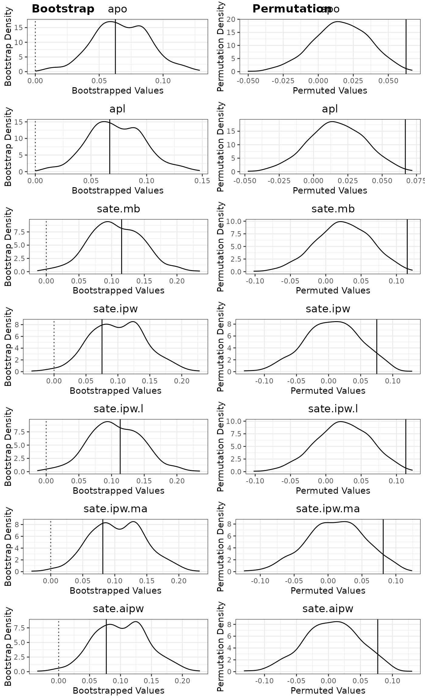

### S3 Methods for Objects Returned by rain_attr()

The S3 object returned by the main function `rain_attr` is of class
`rain_attr`, which supports a wide range of common S3 methods:

- `coef`: computes the fixed effect coefficients and the EBLUPs of
  random intercepts if the selected model is a LMM, or the regression
  coefficients if the selected model is a GLM.

- `print`: Print point estimates of attributions and SATEs, along with
  additional information for the fitted upwind (first-stage) and
  downwind (second-stage) LMMs.

- `residuals`: Compute residuals of various types for the selected
  model.

- `fitted` Compute fitted values of the selected model.

- `varcomp`: Compute the random intercept variance and error variance
  for the different fitted LMMs.

- `predict`: Computed predictions using the selected model.

- `plot`: Plot the bootstrap and permutation distributions of
  attribution and SATE estimates. Alternatively, can also be used to
  obtain model diagnostic plots for the selected model.

- `summary`: Returns a list of summary statistics of the two-stage LMM
  approach, which is an object of class `summary.rain_attr`. This object
  can be called to print the point estimates of attributions and SATE,
  along with their bootstrap confidence intervals, bootstrap p-values
  and permutation p-values if bootstrap and permutation has been
  performed.

We provide some example usage of these S3 methods below, noting that
most of these S3 methods require the selection of a model through the
argument `model`, which must be one of “`upwind_lmm`”, “`downwind_lmm`”
(default), “`downwind_target_lmm`”, “`downwind_control_lmm`”,
“`downwind_logistic`”, or “`downwind_propensity`”

Coefficients of the downwind (second-stage) LMM:

``` r

coef(boot_perm_result, model = 'downwind_lmm')$fixef_coef
#>                 (Intercept)             Gauge.Elevation 
#>                  0.30782064                 -0.19576293 
#>                 Target.H.01                 Target.H.02 
#>                  0.31568597                  0.23977373 
#>                 Target.H.03                 Target.H.04 
#>                  0.23675150                 -0.14009800 
#>                 Target.H.05                 Target.H.06 
#>                  0.41804072                 -0.20023955 
#>                 Target.H.07                 Target.H.08 
#>                  0.23091236                  0.07861614 
#>                 Target.H.09                 Target.H.10 
#>                  0.56479275                  0.05267170 
#> Gauge.Elevation:Target.H.01 Gauge.Elevation:Target.H.02 
#>                 -0.13348185                 -0.19775235
head(coef(boot_perm_result, model = 'downwind_lmm')$ranef_coef)
#>          (Intercept)
#> 2013135 -0.191334499
#> 2013149  0.231232226
#> 2013150  0.841928530
#> 2013151  0.382101947
#> 2013152 -0.221780948
#> 2013157 -0.001806244
```

Residuals of the upwind (first-stage) LMM:

``` r

head(residuals(boot_perm_result, model = 'upwind_lmm', residual_type = 'response', residual_scaled = T))
#>        1040        1826        1827        1830        1921        1954 
#> -0.13134488 -1.37334048  1.98155739 -0.48260149  0.04352322  1.21770555
```

Prediction using the downwind (second-stage) LMM, which consists of both
the estimated fixed effects and the EBLUP of the random intercept:

``` r

#Predicting for these two observations:
oman[1:2,]
#>   Year YearDay Month TrialDay Year...2013 Year...2014 Year...2015 Year...2016
#> 1 2013     135     5  2013135           1           0           0           0
#> 2 2013     135     5  2013135           1           0           0           0
#>   Year...2017 Year...2018 H1on H2on H3on H4on H5on H6on H7on H8on H9on H10on
#> 1           0           0    1    0   NA   NA   NA   NA   NA   NA   NA    NA
#> 2           0           0    1    0   NA   NA   NA   NA   NA   NA   NA    NA
#>   Gauge.ID Gauge.Latitude Gauge.Longitude Gauge.Elevation Elevated.Gauge
#> 1        1       22.79050        57.85393           0.479              0
#> 2        2       22.84042        57.87990           0.540              0
#>   Gauge.Elevation...1km Gauge.Elevation...1km.1 Rain.Gauge.Measurement
#> 1                 0.479                       0                      0
#> 2                 0.540                       0                      0
#>   Rainfall.Event Positive.Rainfall LogRain Rainfall.Measurement.Status
#> 1              0                NA      NA                    Downwind
#> 2              0                NA      NA                    Downwind
#>   Target.H.01 Target.H.02 Target.H.03 Target.H.04 Target.H.05 Target.H.06
#> 1           0           0           0           0           0           0
#> 2           0           0           0           0           0           0
#>   Target.H.07 Target.H.08 Target.H.09 Target.H.10 Gauge.Day.Type
#> 1           0           0           0           0        Control
#> 2           0           0           0           0        Control
#>   Steering.Wind.Direction Steering.Wind.Principal.Direction Steering.Wind.Speed
#> 1                     325                               NNW            6.687778
#> 2                     325                               NNW            6.687778
#>   Lifted.Index Total.Totals LCL.Pressure Precipitable.Water PC1.Dry.Temperature
#> 1         8.03         34.6       607.24              15.77            1.089538
#> 2         8.03         34.6       607.24              15.77            1.089538
#>   PC2.Dry.Temperature PC1.Relative.Humidity PC2..Relative.Humidity
#> 1            3.045836             -2.183532              -2.494393
#> 2            3.045836             -2.183532              -2.494393
#>   PC1.Ground.Level.Pressure
#> 1                 0.4760997
#> 2                 0.4760997

predict(boot_perm_result, newdata = oman[1:2,], model = 'downwind_lmm', re_include = TRUE, fixef_include = TRUE)
#>          1          2 
#> 0.02271570 0.01077416
```

Diagnostic plots for downwind (second-stage) LMM:

``` r

plot(boot_perm_result, plot_type = 'model', model = 'downwind_lmm')
```

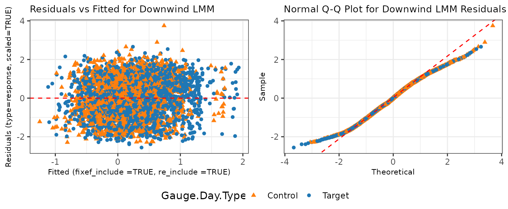

For more details on these S3 methods applicable to the `rain_attr` class
object as well as the returned value from the `summary` method, we refer
to
[`help("rain_attr-class")`](https://zy1225.github.io/RainAttr/reference/rain_attr-class.md).

## eda() - Exploratory Data Analysis Plotting Function

The package also provide another function `eda` that performs various
exploratory data analyses (EDA) on gauge-day level rainfall enhancement
trial data, with the argument `eda_type` controlling the type of EDA:

- `eda_type = num_obs_days`: Compute contigency tables of the number of
  observations and number of unique days, with rows corresponding to
  different types of gauge-day observations, and columns corresponding
  to positive vs. zero rainfall events.

- `eda_type = num_obs_days_by_year`: Same as `eda_type = num_obs_days`,
  but computed separately for each year.

- `eda_type = hist_day_group_sizes`: Plot histograms of groups sizes for
  days with positive rainfall using different types of gauge-day
  observations.

- `eda_type = qq_rain`: Produce Normal Q-Q plots for positive rainfall
  values (raw or log-transformed) of different types of gauge-day
  observations.

- `eda_type = ts_by_type`: Plots daily average positive rainfall (raw or
  log-transformed) by types of gauge-day observations, facetted by year.

- `eda_type = ts_by_gauge`: Plots daily rainfall (raw or
  log-transformed) time series for each gauge, optionally highlighting a
  subset of gauges, with faceting by year.

- `eda_type = ts_by_gauge_interactive`: Interactive version of
  `eda_type = ts_by_gauge` using `plotly`, with points showing gauge
  identifiers on hover.

- `eda_type = map_static`: Produce a spatial map of annual average
  positive rainfall (raw or log-transformed). Optional features include
  overlaying a polygon layer, adding elevation contour lines, and
  displaying ionizer locations.

- `eda_type = map_dynamic`: Produce an animated map of daily rainfall
  (raw or log-transformed). The animation can optionally be restricted
  to a specific year and may include a polygon overlay, elevation
  contour lines, and ionizer locations.

We provide some example usage of this `eda` function below.

Contingency tables of rainfall events against type of gauge-day
observations:

``` r

contigency_table = eda(eda_type = "num_obs_days",
              data = oman,
              day_column_name = 'TrialDay',
              upwind_subset = Gauge.Day.Type == 'Upwind',
              downwind_subset = Gauge.Day.Type  %in% c('Target','Control'),
              downwind_target_subset = Gauge.Day.Type == 'Target',
              downwind_control_subset = Gauge.Day.Type == 'Control',
              positive_subset = Rain.Gauge.Measurement > 0
)
contigency_table
#> $num_obs
#>                                            Rain.Gauge.Measurement > 0
#> Gauge.Day.Type == "Upwind"                                       1545
#> Gauge.Day.Type %in% c("Target", "Control")                       4168
#> Gauge.Day.Type == "Target"                                       2176
#> Gauge.Day.Type == "Control"                                      1992
#>                                            !(Rain.Gauge.Measurement > 0)
#> Gauge.Day.Type == "Upwind"                                         29440
#> Gauge.Day.Type %in% c("Target", "Control")                         39108
#> Gauge.Day.Type == "Target"                                         20939
#> Gauge.Day.Type == "Control"                                        18169
#> 
#> $num_unique_days
#>                                            Rain.Gauge.Measurement > 0
#> Gauge.Day.Type == "Upwind"                                        292
#> Gauge.Day.Type %in% c("Target", "Control")                        488
#> Gauge.Day.Type == "Target"                                        407
#> Gauge.Day.Type == "Control"                                       404
#>                                            !(Rain.Gauge.Measurement > 0)
#> Gauge.Day.Type == "Upwind"                                           740
#> Gauge.Day.Type %in% c("Target", "Control")                           740
#> Gauge.Day.Type == "Target"                                           739
#> Gauge.Day.Type == "Control"                                          740
```

Histogram of group sizes for each trial day with positive rainfall,
i.e., the group size of one trial day is defined as the number of
gauge-day observations within that day that recorded positive rainfall
and satisfied the specific type of gauge-day observation (such as upwind
or downwind):

``` r

hist_example = eda(eda_type = "hist_day_group_sizes",
              data = oman,
              day_column_name = 'TrialDay',
              upwind_subset = Gauge.Day.Type == 'Upwind',
              downwind_subset = Gauge.Day.Type  %in% c('Target','Control'),
              positive_subset = Rain.Gauge.Measurement > 0
)
hist_example
#> $upwind_positive_hist
```

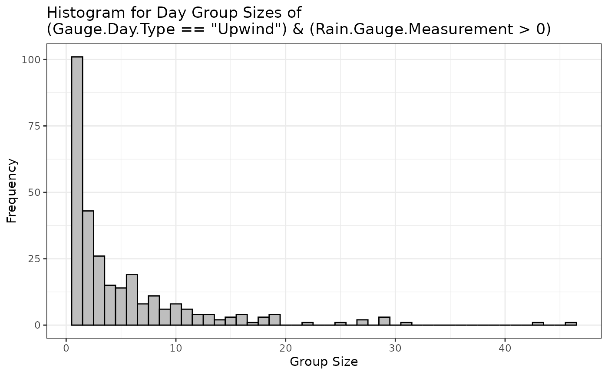

    #> 
    #> $downwind_positive_hist

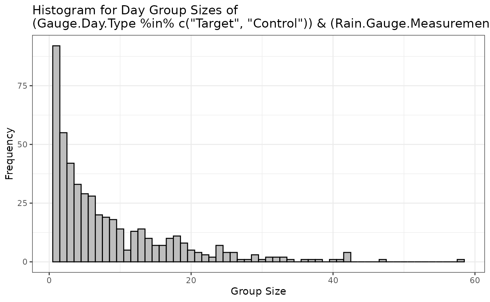

Daily rainfall (on log-scale) time series for each gauge, with the gauge
at the lowest elevation highlighted:

``` r

daily_lograin_by_gauge = eda(eda_type = "ts_by_gauge",
              data = oman,
              rain_col_name = 'Rain.Gauge.Measurement',
              day_column_name = 'TrialDay',
              year_column_name = 'Year',
              use_raw = FALSE,
              gauge_id_column_name = 'Gauge.ID',
              ts_focus_gauge = unique(oman$Gauge.ID[oman$Gauge.Elevation == min(oman$Gauge.Elevation)]))
daily_lograin_by_gauge
```

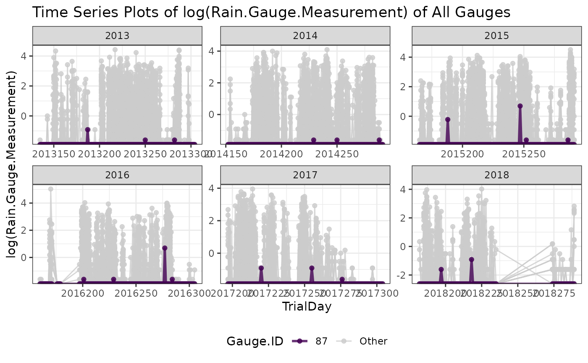

Spatial maps of annual average rainfall (on log scale) facetted by year,
with map polygon layer for Oman added using
`input_sf = rnaturalearth::ne_countries(scale = "large", country = "Oman", returnclass = "sf")`,
ionizer locations plotted using
`ionizer_location_df = ionizer_location`, and elevation contour lines
added using `elev_contour = TRUE`:

``` r

annual_map = eda(eda_type = "map_static",
              data = oman,
              rain_col_name = 'Rain.Gauge.Measurement',
              day_column_name = 'TrialDay',
              year_column_name = 'Year',
              use_raw = F,
              longlat_column_names = c("Gauge.Longitude", "Gauge.Latitude"),
              long_lim = c(55,60),
              lat_lim = c(22,25),
              input_sf = rnaturalearth::ne_countries(scale = "large", country = "Oman", returnclass = "sf"),
              ionizer_location_df = ionizer_location,
              ionizer_id_column_name = 'Ionizer',
              ionizer_longlat_column_names = c("Longitude","Latitude"),
              elev_contour = TRUE,
              elev_resolution = 2,
              positive_subset = Rain.Gauge.Measurement > 0
)
#> Mosaicing & Projecting
#> Clipping DEM to bbox
#> Note: Elevation units are in meters.
annual_map
```

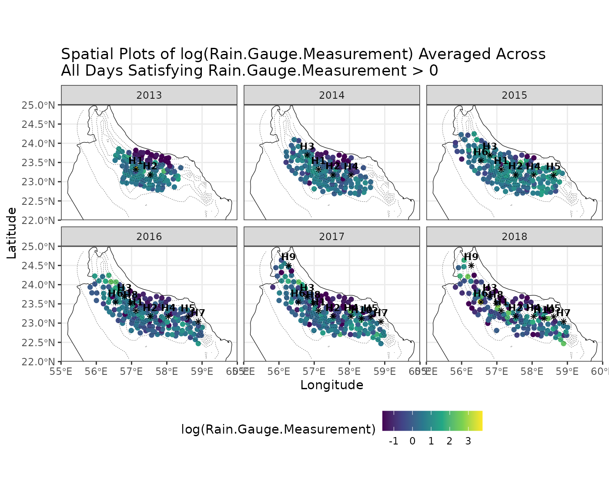

Animated map of daily rainfall (on log scale), with map polygon layer
for Oman added using
`input_sf = rnaturalearth::ne_countries(scale = "large", country = "Oman", returnclass = "sf")`,
ionizer locations plotted using
`ionizer_location_df = ionizer_location`, elevation contour lines added
using `elev_contour = TRUE`, and wind direction arrows added using
`wind_direction_column_name = "Steering.Wind.Direction"` along with wind
speed supplied via `wind_speed_column_name = "Steering.Wind.Speed"`,
noting that `long_lim = c(55,60)` and `lat_lim = c(20,25)` are used to
ensure a square map is produced so that the wind arrow lengths appear
visually consistent across directions:

``` r

animated_map = eda(eda_type = "map_dynamic",
              data = oman,
              rain_col_name = 'Rain.Gauge.Measurement',
              day_column_name = 'TrialDay',
              year_column_name = 'Year',
              use_raw = F,
              longlat_column_names = c("Gauge.Longitude", "Gauge.Latitude"),
              long_lim = c(55,60),
              lat_lim = c(20,25),
              input_sf = rnaturalearth::ne_countries(scale = "large", country = "Oman", returnclass = "sf"),
              ionizer_location_df = ionizer_location,
              ionizer_id_column_name = 'Ionizer',
              ionizer_longlat_column_names = c("Longitude","Latitude"),
              elev_contour = TRUE,
              elev_resolution = 2,
              wind_direction_column_name = "Steering.Wind.Direction", 
              wind_arrow_long_lat = c(59.25,24.5), 
              wind_speed_column_name = "Steering.Wind.Speed", 
              wind_speed_scaling = 0.075,
              focus_year = c(2013),
              fps = 30
)
#> Mosaicing & Projecting
#> Clipping DEM to bbox
#> Note: Elevation units are in meters.

animated_map$gif_image
```

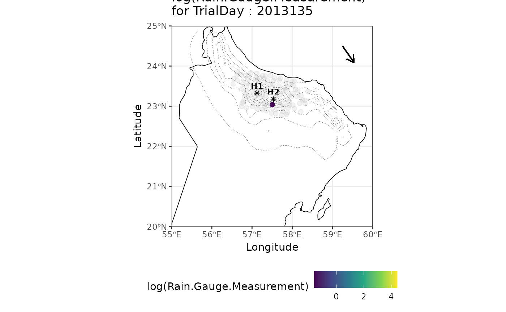

For more details on the `eda` function, we refer to
[`help(eda)`](https://zy1225.github.io/RainAttr/reference/eda.md).

## Datasets Included with RainAttr

The package also contains the following four datasets containing
information for the 2013 – 2018 Oman rainfall enhancement trial, which
were used in the analyses of Chambers, Beare, et al. (2022) and
Chambers, Ranjbar, et al. (2022):

- `oman`: contains gauge-day observations from the 2013 – 2018 Oman
  trial with 55 variables that could be used for the two-stage LMM
  modelling. See
  [`help(oman)`](https://zy1225.github.io/RainAttr/reference/oman.md)
  for more details.

- `ionizer_location`: contains the latitude and longitude of the ten
  ionizers and their deployment timing during the 2013 – 2018 Oman
  trial. See
  [`help(ionizer_location)`](https://zy1225.github.io/RainAttr/reference/ionizer_location.md)
  for more details.

- `ionizer_operation`: contains the daily operation schedule of the
  ionizers during the 2013 – 2018 Oman trial. See
  [`help(ionizer_operation)`](https://zy1225.github.io/RainAttr/reference/ionizer_operation.md)
  for more details.

- `gaugeday_downwind`: contains binary indicators of whether each
  gauge-day observation (in the `oman` dataset) is downwind of each
  ionizer during the 2013 – 2018 Oman trial. See
  [`help(gaugeday_downwind)`](https://zy1225.github.io/RainAttr/reference/gaugeday_downwind.md)
  for more details.

## Replicating the Attribution Analysis of Chambers, Beare, et al. (2022)

The package can be used to replicate the `apl` attribution analysis of
Chambers, Beare, et al. (2022), published in International Statistical
Review, “Nudging a Pseudo-Science Towards a Science - The Role of
Statistics in a Rainfall Enhancement Trial in Oman”, noting that this
paper focused on the `apl` attribution.

### Headline Statistical Analysis in Section 5.1 of Chambers, Beare, et al. (2022)

The headline analysis presented in Section 5.1 can be reproduced using
the code below. Note that Chambers, Beare, et al. (2022) used the
unconditional fitted value from upwind (first-stage) model
(`instr_pred_type = 'Unconditional'`), estimated the attribution `apl`
using their proposed method (`attr_type = 'ChambersEtAl'`), and made use
of the REB2 type bootstrap (`bootstrap_opt(bootstrap_type = 'REB2')`).
See
[`help(rain_attr)`](https://zy1225.github.io/RainAttr/reference/rain_attr.md)
and
[`help(bootstrap_downwind)`](https://zy1225.github.io/RainAttr/reference/bootstrap_downwind.md)
for further details on the `attr_type = 'ChambersEtAl'` attribution
estimator and the REB2 type bootstrap, respectively. Moreover, the
unconditional fitted value from upwind (first-stage) model is included
as a covariate in the RHS of the `downwind_lmm_formula`, instead of an
offset term in the LHS of the `downwind_lmm_formula`.

``` r

headline = rain_attr(
  data = oman,
  upwind_lmm_formula = LogRain ~  Gauge.Elevation + Steering.Wind.Speed + Total.Totals + PC2.Dry.Temperature + PC1.Relative.Humidity + PC1.Ground.Level.Pressure + (1|TrialDay),
  instr_pred_name = 'natural_pred',
  instr_pred_type = 'Unconditional',
  downwind_lmm_formula = LogRain  ~ Gauge.Elevation + natural_pred  + Target.H.01 + Target.H.02 + Target.H.03 + Target.H.04 + Target.H.05 + Target.H.06 + Target.H.07 + Target.H.08 + Target.H.09 + Target.H.10 + Gauge.Elevation:Target.H.01 + Gauge.Elevation:Target.H.02 + (1|TrialDay),
  downwind_logistic_formula = (Rain.Gauge.Measurement > 0) ~ Gauge.Elevation + natural_pred  + Target.H.01 + Target.H.02 + Target.H.03 + Target.H.04 + Target.H.05 + Target.H.06 + Target.H.07 + Target.H.08 + Target.H.09 + Target.H.10 + Gauge.Elevation:Target.H.01 + Gauge.Elevation:Target.H.02,
  downwind_propensity_formula = (Gauge.Day.Type == 'Target') ~ Total.Totals + PC1.Dry.Temperature + PC1.Relative.Humidity + PC1.Ground.Level.Pressure,
  rain_col_name = 'Rain.Gauge.Measurement',
  upwind_subset = Gauge.Day.Type == 'Upwind',
  downwind_subset = Gauge.Day.Type  %in% c('Target','Control'),
  downwind_target_subset = Gauge.Day.Type == 'Target',
  downwind_control_subset = Gauge.Day.Type == 'Control',
  positive_subset = Rain.Gauge.Measurement > 0,
  attr_type = 'ChambersEtAl',
  x_downwind_name = c('Gauge.Elevation', 'natural_pred'),
  bootstrap = TRUE,
  bootstrap_option = bootstrap_opt(B_bootstrap = 500,
                                   bootstrap_type = 'REB2',
                                   bootstrap_seed = 1, 
                                   bootstrap_parallel = TRUE,
                                   bootstrap_parallel_num_worker = n_workers),
  permutation = TRUE,
  permutation_option = permutation_opt(B_permutation = 500,
                                       permutation_seed = 321,
                                       permutation_parallel = TRUE,
                                       permutation_parallel_num_worker = n_workers)
  )
```

Table 3 and 4, which are identical to the following summary tables of
upwind (first-stage) and downwind (second-stage) LMM, respectively:

``` r

summary(headline)
#> Summary of Two Stage LMM Rainfall Enhancement Analysis
#> ======================================================================
#> 
#> Attribution Results (Assuming Log-Rainfall being Modelled):
#>     Estimate  95% Bootstrap CI Bootstrap P-Val Permutation P-Val
#> apo   11.12% (7.6667%, 14.82%)            0***              0***
#> apl   12.51% (8.5784%, 16.97%)            0***              0***
#> ---
#> Signif. codes:  0 '***' 0.001 '**' 0.01 '*' 0.05 '.' 0.1 ' ' 1
#> 
#> SATE Results:
#>             Estimate  95% Bootstrap CI Bootstrap P-Val Permutation P-Val
#> sate.mb       0.1144  (0.0533, 0.1779)            0***             0.02*
#> sate.ipw      0.0740  (-0.012, 0.1653)           0.05.             0.07.
#> sate.ipw.l    0.1123  (0.0514, 0.1756)            0***             0.02*
#> sate.ipw.ma   0.0654 (-0.0183, 0.1589)           0.06.             0.08.
#> sate.aipw     0.0774 (-0.0089, 0.1689)           0.04*             0.06.
#> ---
#> Signif. codes:  0 '***' 0.001 '**' 0.01 '*' 0.05 '.' 0.1 ' ' 1
#> 
#> 
#> ======================================================================
#> 
#> Upwind (First Stage) LMM:
#> Formula:
#> LogRain ~ Gauge.Elevation + Steering.Wind.Speed + Total.Totals + 
#>     PC2.Dry.Temperature + PC1.Relative.Humidity + PC1.Ground.Level.Pressure + 
#>     (1 | TrialDay)
#> 
#> Data subset used: oman [ Gauge.Day.Type == "Upwind"  &  Rain.Gauge.Measurement > 0 , ]
#> Number of observations: 1545, Number of groups: 292
#> 
#> Random effects:
#>    Groups        Name  Variance
#>  TrialDay (Intercept) 0.4158771
#>  Residual             1.6003327
#> 
#> Fixed effects:
#>                           Estimate Std. Error t value
#> (Intercept)                -1.4397     0.3988 -3.6104
#> Gauge.Elevation             0.4340     0.0740  5.8631
#> Steering.Wind.Speed        -0.0964     0.0204 -4.7277
#> Total.Totals                0.0327     0.0083  3.9204
#> PC2.Dry.Temperature         0.1448     0.0527  2.7454
#> PC1.Relative.Humidity       0.1779     0.0223  7.9681
#> PC1.Ground.Level.Pressure  -0.0523     0.0201 -2.6041
#> 
#> ======================================================================
#> 
#> Downwind (Second Stage) LMM:
#> Formula:
#> LogRain ~ Gauge.Elevation + natural_pred + Target.H.01 + Target.H.02 + 
#>     Target.H.03 + Target.H.04 + Target.H.05 + Target.H.06 + Target.H.07 + 
#>     Target.H.08 + Target.H.09 + Target.H.10 + Gauge.Elevation:Target.H.01 + 
#>     Gauge.Elevation:Target.H.02 + (1 | TrialDay)
#> 
#> Data subset used: oman [ Gauge.Day.Type %in% c("Target", "Control")  &  Rain.Gauge.Measurement > 0 , ]
#> Number of observations: 4168, Number of groups: 488
#> 
#> Random effects:
#>    Groups        Name  Variance
#>  TrialDay (Intercept) 0.2737032
#>  Residual             1.8558029
#> 
#> Fixed effects:
#>                             Estimate Std. Error t value
#> (Intercept)                   0.2797     0.0642  4.3603
#> Gauge.Elevation              -0.1250     0.0657 -1.9034
#> natural_pred                  0.8557     0.0581 14.7335
#> Target.H.01                   0.2892     0.1361  2.1244
#> Target.H.02                   0.2576     0.1236  2.0837
#> Target.H.03                   0.2382     0.0925  2.5761
#> Target.H.04                  -0.1527     0.0889 -1.7172
#> Target.H.05                   0.4325     0.1318  3.2819
#> Target.H.06                  -0.2033     0.1492 -1.3624
#> Target.H.07                   0.2220     0.1875  1.1842
#> Target.H.08                   0.0585     0.1273  0.4595
#> Target.H.09                   0.4815     0.3058  1.5744
#> Target.H.10                   0.0344     0.1675  0.2057
#> Gauge.Elevation:Target.H.01  -0.0866     0.1437 -0.6029
#> Gauge.Elevation:Target.H.02  -0.2166     0.1196 -1.8115
```

Chambers, Beare, et al. (2022) reported a 95% bootstrap CI for `apl` in
Section 5.1 as (10.10%,23.09%), based on 10000 bootstrap replicates,
with a bootstrap p-value of less than 0.0001. In addition, they also
reported a permutation p-value of 0.0007. Our bootstrap and permutation
results for `apl` presented below differ for several reasons:

- The inherent of the bootstrap and permutation procedure, as well as
  the smaller number of bootstrap and permutation replicates used here
  (`bootstrap_opt(B_bootstrap = 500)` and
  `permutation_opt(B_permutation = 500)`) to reduce computational cost

- More importantly, the original implementation of the `apl` estimator
  in Chambers, Beare, et al. (2022) contained a coding error, which has
  been corrected in the present implementation.

``` r

summary(headline)$attr_table[2,]
#>     Estimate  95% Bootstrap CI Bootstrap P-Val Permutation P-Val
#> apl   12.51% (8.5784%, 16.97%)               0                 0
```

The following plots aim to replicate Figure 7, noting that some
differences remain due to the same reasons outlined above.

``` r

headline$bootstrap_plot_result$hatattr$apl + ggplot2::ggtitle('Bootstrap Distribution of Attribution\n (% Natural Rainfall)') + ggplot2::theme(plot.title = ggplot2::element_text(hjust = 0.5))
```

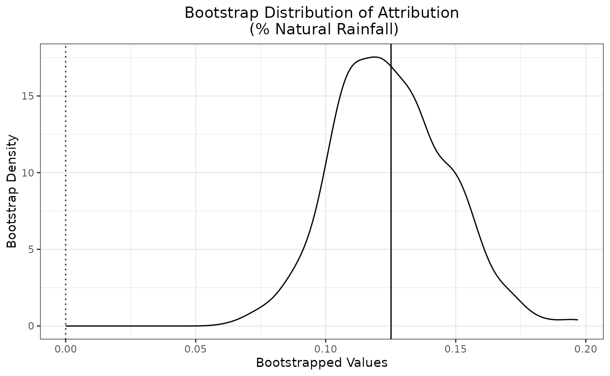

``` r

headline$permutation_plot_result$hatattr$apl + ggplot2::ggtitle('Permutation Distribution of Attribution\n (% Natural Rainfall)') + ggplot2::theme(plot.title = ggplot2::element_text(hjust = 0.5))
```

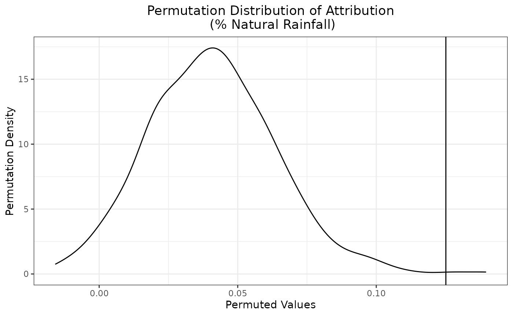

### After the Event Statistical Analyses in Section 5.2 of Chambers, Beare, et al. (2022)

The after the event statistical analyses presented in Section 5.2 can
also be replicated using the package. In particular, these analyses
correspond to the three columns in Table 6: 2013-2018, 2013-2015,
2016-2018.

In the following, we replicate the parameter estimates and associated
t-values for the downwind (second-stage) LMM presented in each column of
Table 6, noting that the `apl` attribution estimates (except for the
2016-2018 column) differ due to the aforementioned coding error in the
original implementation.

2013-2018 column:

``` r

#2013-2018 column
table6_2013_2018 = rain_attr(
  data = oman,
  upwind_lmm_formula = LogRain ~  Year...2014 +  Year...2016 + Year...2017 + Year...2018 + Gauge.Elevation...1km + Gauge.Elevation...1km.1 + Steering.Wind.Speed + Total.Totals + PC2.Dry.Temperature + PC1.Relative.Humidity + PC1.Ground.Level.Pressure + (1|TrialDay),
  instr_pred_name = 'natural_pred',
  instr_pred_type = 'Unconditional',
  downwind_lmm_formula = LogRain  ~ Year...2013 + Year...2014 + Year...2016 + Year...2017 + Year...2018 + Gauge.Elevation...1km + Gauge.Elevation...1km.1 + natural_pred  + Target.H.01 + Target.H.02 + Target.H.03 + Target.H.04 + Target.H.05 + Target.H.06 + Target.H.07 + Target.H.08 + Target.H.09 + Target.H.10 + Gauge.Elevation...1km:Target.H.01 + Gauge.Elevation...1km:Target.H.02 + Gauge.Elevation...1km.1:Target.H.01 + Gauge.Elevation...1km.1:Target.H.02 + (1|TrialDay),
  downwind_logistic_formula = (Rain.Gauge.Measurement > 0) ~ Year...2013 + Year...2014 + Year...2016 + Year...2017 + Year...2018 + Gauge.Elevation...1km + Gauge.Elevation...1km.1 + natural_pred  + Target.H.01 + Target.H.02 + Target.H.03 + Target.H.04 + Target.H.05 + Target.H.06 + Target.H.07 + Target.H.08 + Target.H.09 + Target.H.10 + Gauge.Elevation...1km:Target.H.01 + Gauge.Elevation...1km:Target.H.02 + Gauge.Elevation...1km.1:Target.H.01 + Gauge.Elevation...1km.1:Target.H.02,
  downwind_propensity_formula = (Gauge.Day.Type == 'Target') ~ Year...2013 + Year...2014 +  Year...2016 + Year...2017 + Year...2018 + Gauge.Elevation...1km + Gauge.Elevation...1km.1 + Steering.Wind.Speed + Total.Totals + PC2.Dry.Temperature + PC1.Relative.Humidity + PC1.Ground.Level.Pressure,
  rain_col_name = 'Rain.Gauge.Measurement',
  upwind_subset = Gauge.Day.Type == 'Upwind' & Year != 2013,
  downwind_subset = Gauge.Day.Type  %in% c('Target','Control'),
  downwind_target_subset = Gauge.Day.Type == 'Target',
  downwind_control_subset = Gauge.Day.Type == 'Control',
  positive_subset = Rain.Gauge.Measurement > 0,
  attr_type = 'ChambersEtAl',
  x_downwind_name = c('Year...2013' , 'Year...2014' , 'Year...2016' , 'Year...2017' , 'Year...2018' , 'Gauge.Elevation...1km' , 'Gauge.Elevation...1km.1' , 'natural_pred'),
  bootstrap = TRUE,
  bootstrap_option = bootstrap_opt(B_bootstrap = 500,
                                   bootstrap_type = 'REB2',
                                   bootstrap_seed = 11, 
                                   bootstrap_parallel = TRUE,
                                   bootstrap_parallel_num_worker = n_workers),
  permutation = TRUE,
  permutation_option = permutation_opt(B_permutation = 500,
                                       permutation_seed = 3211,
                                       permutation_parallel = TRUE,
                                       permutation_parallel_num_worker = n_workers)
)

summary(table6_2013_2018)
#> Summary of Two Stage LMM Rainfall Enhancement Analysis
#> ======================================================================
#> 
#> Attribution Results (Assuming Log-Rainfall being Modelled):
#>     Estimate   95% Bootstrap CI Bootstrap P-Val Permutation P-Val
#> apo   12.29%  (8.9847%, 16.09%)            0***              0***
#> apl   14.01% (10.1853%, 18.66%)            0***              0***
#> ---
#> Signif. codes:  0 '***' 0.001 '**' 0.01 '*' 0.05 '.' 0.1 ' ' 1
#> 
#> SATE Results:
#>             Estimate 95% Bootstrap CI Bootstrap P-Val Permutation P-Val
#> sate.mb       0.1259 (0.0669, 0.1849)            0***             0.01*
#> sate.ipw      0.0821 (0.0023, 0.1683)           0.02*              0.12
#> sate.ipw.l    0.1229 (0.0658, 0.1819)            0***             0.01*
#> sate.ipw.ma   0.0828 (0.0033, 0.1692)           0.02*              0.12
#> sate.aipw     0.0842 (0.0035, 0.1686)           0.02*              0.12
#> ---
#> Signif. codes:  0 '***' 0.001 '**' 0.01 '*' 0.05 '.' 0.1 ' ' 1
#> 
#> 
#> ======================================================================
#> 
#> Upwind (First Stage) LMM:
#> Formula:
#> LogRain ~ Year...2014 + Year...2016 + Year...2017 + Year...2018 + 
#>     Gauge.Elevation...1km + Gauge.Elevation...1km.1 + Steering.Wind.Speed + 
#>     Total.Totals + PC2.Dry.Temperature + PC1.Relative.Humidity + 
#>     PC1.Ground.Level.Pressure + (1 | TrialDay)
#> 
#> Data subset used: oman [ Gauge.Day.Type == "Upwind" & Year != 2013  &  Rain.Gauge.Measurement > 0 , ]
#> Number of observations: 1316, Number of groups: 237
#> 
#> Random effects:
#>    Groups        Name  Variance
#>  TrialDay (Intercept) 0.3616803
#>  Residual             1.5560159
#> 
#> Fixed effects:
#>                           Estimate Std. Error t value
#> (Intercept)                -2.0845     0.4633 -4.4987
#> Year...2014                -0.1249     0.1784 -0.7003
#> Year...2016                -0.2848     0.1809 -1.5745
#> Year...2017                -0.2850     0.1889 -1.5089
#> Year...2018                -0.3501     0.2146 -1.6310
#> Gauge.Elevation...1km       0.8657     0.1952  4.4351
#> Gauge.Elevation...1km.1     0.4223     0.0938  4.5024
#> Steering.Wind.Speed        -0.0615     0.0230 -2.6746
#> Total.Totals                0.0421     0.0095  4.4317
#> PC2.Dry.Temperature         0.1190     0.0545  2.1856
#> PC1.Relative.Humidity       0.1634     0.0227  7.1913
#> PC1.Ground.Level.Pressure  -0.0411     0.0207 -1.9838
#> 
#> ======================================================================
#> 
#> Downwind (Second Stage) LMM:
#> Formula:
#> LogRain ~ Year...2013 + Year...2014 + Year...2016 + Year...2017 + 
#>     Year...2018 + Gauge.Elevation...1km + Gauge.Elevation...1km.1 + 
#>     natural_pred + Target.H.01 + Target.H.02 + Target.H.03 + 
#>     Target.H.04 + Target.H.05 + Target.H.06 + Target.H.07 + Target.H.08 + 
#>     Target.H.09 + Target.H.10 + Gauge.Elevation...1km:Target.H.01 + 
#>     Gauge.Elevation...1km:Target.H.02 + Gauge.Elevation...1km.1:Target.H.01 + 
#>     Gauge.Elevation...1km.1:Target.H.02 + (1 | TrialDay)
#> 
#> Data subset used: oman [ Gauge.Day.Type %in% c("Target", "Control")  &  Rain.Gauge.Measurement > 0 , ]
#> Number of observations: 4168, Number of groups: 488
#> 
#> Random effects:
#>    Groups        Name  Variance
#>  TrialDay (Intercept) 0.2251801
#>  Residual             1.8529757
#> 
#> Fixed effects:
#>                                     Estimate Std. Error t value
#> (Intercept)                           0.0765     0.1208  0.6332
#> Year...2013                           0.4058     0.1132  3.5834
#> Year...2014                           0.3357     0.1064  3.1554
#> Year...2016                           0.2586     0.1153  2.2430
#> Year...2017                           0.0923     0.1192  0.7743
#> Year...2018                           0.0405     0.1463  0.2770
#> Gauge.Elevation...1km                -0.1996     0.1640 -1.2174
#> Gauge.Elevation...1km.1              -0.0962     0.0709 -1.3577
#> natural_pred                          0.9451     0.0591 15.9968
#> Target.H.01                           0.4807     0.2470  1.9463
#> Target.H.02                           0.8403     0.2930  2.8680
#> Target.H.03                           0.2411     0.0922  2.6142
#> Target.H.04                          -0.1140     0.0888 -1.2837
#> Target.H.05                           0.4992     0.1317  3.7904
#> Target.H.06                          -0.1364     0.1489 -0.9164
#> Target.H.07                           0.3355     0.1879  1.7859
#> Target.H.08                           0.1315     0.1284  1.0239
#> Target.H.09                           0.7113     0.3065  2.3206
#> Target.H.10                           0.1955     0.1700  1.1499
#> Gauge.Elevation...1km:Target.H.01    -0.4878     0.3634 -1.3423
#> Gauge.Elevation...1km:Target.H.02    -1.2718     0.4685 -2.7147
#> Gauge.Elevation...1km.1:Target.H.01  -0.1627     0.1585 -1.0261
#> Gauge.Elevation...1km.1:Target.H.02  -0.4583     0.1718 -2.6683
```

2013-2015 column:

``` r

#2013-2015 column
table6_2013_2015 = rain_attr(
  data = oman,
  upwind_lmm_formula = LogRain ~  Year...2014  + Gauge.Elevation...1km + Gauge.Elevation...1km.1 + Steering.Wind.Speed + Total.Totals + PC2.Dry.Temperature + PC1.Relative.Humidity + PC1.Ground.Level.Pressure + (1|TrialDay),
  instr_pred_name = 'natural_pred',
  instr_pred_type = 'Unconditional',
  downwind_lmm_formula = LogRain  ~ Year...2013 + Year...2014 + Gauge.Elevation...1km + Gauge.Elevation...1km.1 + natural_pred  + Target.H.01 + Target.H.02 + Target.H.03 + Target.H.04 + Target.H.05 + Target.H.06  + Gauge.Elevation...1km:Target.H.01 + Gauge.Elevation...1km:Target.H.02 + Gauge.Elevation...1km.1:Target.H.01 + Gauge.Elevation...1km.1:Target.H.02 + (1|TrialDay),
  downwind_logistic_formula = (Rain.Gauge.Measurement > 0) ~ Year...2013 + Year...2014 + Gauge.Elevation...1km + Gauge.Elevation...1km.1 + natural_pred  + Target.H.01 + Target.H.02 + Target.H.03 + Target.H.04 + Target.H.05 + Target.H.06  + Gauge.Elevation...1km:Target.H.01 + Gauge.Elevation...1km:Target.H.02 + Gauge.Elevation...1km.1:Target.H.01 + Gauge.Elevation...1km.1:Target.H.02,
  downwind_propensity_formula = (Gauge.Day.Type == 'Target') ~ Year...2013 + Year...2014  + Gauge.Elevation...1km + Gauge.Elevation...1km.1 + Steering.Wind.Speed + Total.Totals + PC2.Dry.Temperature + PC1.Relative.Humidity + PC1.Ground.Level.Pressure,
  rain_col_name = 'Rain.Gauge.Measurement',
  upwind_subset = Gauge.Day.Type == 'Upwind' & Year %in% 2014:2015,
  downwind_subset = Gauge.Day.Type  %in% c('Target','Control') & Year %in% 2013:2015,
  downwind_target_subset = Gauge.Day.Type == 'Target',
  downwind_control_subset = Gauge.Day.Type == 'Control',
  positive_subset = Rain.Gauge.Measurement > 0,
  attr_type = 'ChambersEtAl',
  x_downwind_name = c('Year...2013' , 'Year...2014'  , 'Gauge.Elevation...1km' , 'Gauge.Elevation...1km.1' , 'natural_pred'),
  bootstrap = TRUE,
  bootstrap_option = bootstrap_opt(B_bootstrap = 500,
                                   bootstrap_type = 'REB2',
                                   bootstrap_seed = 199, 
                                   bootstrap_parallel = TRUE,
                                   bootstrap_parallel_num_worker = n_workers),
  permutation = TRUE,
  permutation_option = permutation_opt(B_permutation = 500,
                                       permutation_seed = 3210,
                                       permutation_parallel = TRUE,
                                       permutation_parallel_num_worker = n_workers)
)

summary(table6_2013_2015)
#> Summary of Two Stage LMM Rainfall Enhancement Analysis
#> ======================================================================
#> 
#> Attribution Results (Assuming Log-Rainfall being Modelled):
#>     Estimate  95% Bootstrap CI Bootstrap P-Val Permutation P-Val
#> apo      13% (8.1945%, 17.96%)            0***              0***
#> apl   14.94% (9.3628%, 21.17%)            0***              0***
#> ---
#> Signif. codes:  0 '***' 0.001 '**' 0.01 '*' 0.05 '.' 0.1 ' ' 1
#> 
#> SATE Results:
#>             Estimate  95% Bootstrap CI Bootstrap P-Val Permutation P-Val
#> sate.mb       0.1035  (0.0228, 0.1851)           0.01*             0.01*
#> sate.ipw      0.0460 (-0.0604, 0.1535)            0.21              0.25
#> sate.ipw.l    0.1063  (0.0228, 0.1886)           0.01*             0.01*
#> sate.ipw.ma   0.0463   (-0.06, 0.1527)            0.21              0.25
#> sate.aipw     0.0550 (-0.0524, 0.1613)            0.17              0.19
#> ---
#> Signif. codes:  0 '***' 0.001 '**' 0.01 '*' 0.05 '.' 0.1 ' ' 1
#> 
#> 
#> ======================================================================
#> 
#> Upwind (First Stage) LMM:
#> Formula:
#> LogRain ~ Year...2014 + Gauge.Elevation...1km + Gauge.Elevation...1km.1 + 
#>     Steering.Wind.Speed + Total.Totals + PC2.Dry.Temperature + 
#>     PC1.Relative.Humidity + PC1.Ground.Level.Pressure + (1 | 
#>     TrialDay)
#> 
#> Data subset used: oman [ Gauge.Day.Type == "Upwind" & Year %in% 2014:2015  &  Rain.Gauge.Measurement > 0 , ]
#> Number of observations: 812, Number of groups: 119
#> 
#> Random effects:
#>    Groups        Name  Variance
#>  TrialDay (Intercept) 0.3962586
#>  Residual             1.5939318
#> 
#> Fixed effects:
#>                           Estimate Std. Error t value
#> (Intercept)                -1.9840     0.6854 -2.8947
#> Year...2014                -0.0053     0.1937 -0.0272
#> Gauge.Elevation...1km       0.8004     0.2503  3.1975
#> Gauge.Elevation...1km.1     0.5012     0.1228  4.0816
#> Steering.Wind.Speed        -0.0763     0.0371 -2.0596
#> Total.Totals                0.0392     0.0146  2.6912
#> PC2.Dry.Temperature         0.1109     0.0849  1.3061
#> PC1.Relative.Humidity       0.2185     0.0337  6.4880
#> PC1.Ground.Level.Pressure  -0.0697     0.0329 -2.1161
#> 
#> ======================================================================
#> 
#> Downwind (Second Stage) LMM:
#> Formula:
#> LogRain ~ Year...2013 + Year...2014 + Gauge.Elevation...1km + 
#>     Gauge.Elevation...1km.1 + natural_pred + Target.H.01 + Target.H.02 + 
#>     Target.H.03 + Target.H.04 + Target.H.05 + Target.H.06 + Gauge.Elevation...1km:Target.H.01 + 
#>     Gauge.Elevation...1km:Target.H.02 + Gauge.Elevation...1km.1:Target.H.01 + 
#>     Gauge.Elevation...1km.1:Target.H.02 + (1 | TrialDay)
#> 
#> Data subset used: oman [ Gauge.Day.Type %in% c("Target", "Control") & Year %in% 2013:2015  &  Rain.Gauge.Measurement > 0 , ]
#> Number of observations: 2447, Number of groups: 286
#> 
#> Random effects:
#>    Groups        Name Variance
#>  TrialDay (Intercept) 0.240069
#>  Residual             1.848236
#> 
#> Fixed effects:
#>                                     Estimate Std. Error t value
#> (Intercept)                           0.0235     0.1515  0.1550
#> Year...2013                           0.4771     0.1187  4.0179
#> Year...2014                           0.2732     0.1093  2.5010
#> Gauge.Elevation...1km                -0.0608     0.2193 -0.2772
#> Gauge.Elevation...1km.1              -0.0846     0.0983 -0.8611
#> natural_pred                          0.8833     0.0724 12.2056
#> Target.H.01                           0.5486     0.3020  1.8166
#> Target.H.02                           0.9486     0.3633  2.6109
#> Target.H.03                           0.4130     0.1255  3.2906
#> Target.H.04                          -0.1664     0.1211 -1.3741
#> Target.H.05                           0.7042     0.2308  3.0516
#> Target.H.06                          -0.3491     0.2250 -1.5517
#> Gauge.Elevation...1km:Target.H.01    -0.5988     0.4348 -1.3773
#> Gauge.Elevation...1km:Target.H.02    -1.3498     0.5839 -2.3117
#> Gauge.Elevation...1km.1:Target.H.01  -0.3531     0.1903 -1.8555
#> Gauge.Elevation...1km.1:Target.H.02  -0.5763     0.2152 -2.6779
```

2016-2018 column:

``` r

#2016-2018 column
table6_2016_2018 = rain_attr(
  data = oman,
  upwind_lmm_formula = LogRain ~  Year...2016 + Year...2018 + Gauge.Elevation...1km + Gauge.Elevation...1km.1 + Steering.Wind.Speed + Total.Totals + PC2.Dry.Temperature + PC1.Relative.Humidity + PC1.Ground.Level.Pressure + (1|TrialDay),
  instr_pred_name = 'natural_pred',
  instr_pred_type = 'Unconditional',
  downwind_lmm_formula = LogRain  ~ Year...2016 + Year...2018 + Gauge.Elevation...1km + Gauge.Elevation...1km.1 + natural_pred  + Target.H.01 + Target.H.02 + Target.H.03 + Target.H.04 + Target.H.05 + Target.H.06  + Target.H.07 + Target.H.08 + Target.H.09 + Target.H.10  + (1|TrialDay),
  downwind_logistic_formula = (Rain.Gauge.Measurement > 0) ~ Year...2016 + Year...2018 + Gauge.Elevation...1km + Gauge.Elevation...1km.1 + natural_pred  + Target.H.01 + Target.H.02 + Target.H.03 + Target.H.04 + Target.H.05 + Target.H.06  + Target.H.07 + Target.H.08 + Target.H.09 + Target.H.10,
  downwind_propensity_formula = (Gauge.Day.Type == 'Target') ~ Year...2016 + Year...2018 + Gauge.Elevation...1km + Gauge.Elevation...1km.1 + Steering.Wind.Speed + Total.Totals + PC2.Dry.Temperature + PC1.Relative.Humidity + PC1.Ground.Level.Pressure,
  rain_col_name = 'Rain.Gauge.Measurement',
  upwind_subset = Gauge.Day.Type == 'Upwind' & Year %in% 2016:2018,
  downwind_subset = Gauge.Day.Type  %in% c('Target','Control') & Year %in% 2016:2018,
  downwind_target_subset = Gauge.Day.Type == 'Target',
  downwind_control_subset = Gauge.Day.Type == 'Control',
  positive_subset = Rain.Gauge.Measurement > 0,
  attr_type = 'ChambersEtAl',
  x_downwind_name = c('Year...2016' , 'Year...2018'  , 'Gauge.Elevation...1km' , 'Gauge.Elevation...1km.1' , 'natural_pred'),
  bootstrap = TRUE,
  bootstrap_option = bootstrap_opt(B_bootstrap = 500,
                                   bootstrap_type = 'REB2',
                                   bootstrap_seed = 91, 
                                   bootstrap_parallel = TRUE,
                                   bootstrap_parallel_num_worker = n_workers),
  permutation = TRUE,
  permutation_option = permutation_opt(B_permutation = 500,
                                       permutation_seed = 9321,
                                       permutation_parallel = TRUE,
                                       permutation_parallel_num_worker = n_workers)
)

summary(table6_2016_2018)
#> Summary of Two Stage LMM Rainfall Enhancement Analysis
#> ======================================================================
#> 
#> Attribution Results (Assuming Log-Rainfall being Modelled):
#>     Estimate   95% Bootstrap CI Bootstrap P-Val Permutation P-Val
#> apo   14.66%  (9.0013%, 20.84%)            0***              0***
#> apl   17.18% (10.4577%, 25.28%)            0***              0***
#> ---
#> Signif. codes:  0 '***' 0.001 '**' 0.01 '*' 0.05 '.' 0.1 ' ' 1
#> 
#> SATE Results:
#>             Estimate  95% Bootstrap CI Bootstrap P-Val Permutation P-Val
#> sate.mb       0.1565   (0.062, 0.2427)            0***              0***
#> sate.ipw      0.1243 (-0.0025, 0.2364)           0.03*              0***
#> sate.ipw.l    0.1540  (0.0608, 0.2397)            0***              0***
#> sate.ipw.ma   0.1260  (-6e-04, 0.2366)           0.03*              0***
#> sate.aipw     0.1219 (-0.0074, 0.2352)           0.03*              0***
#> ---
#> Signif. codes:  0 '***' 0.001 '**' 0.01 '*' 0.05 '.' 0.1 ' ' 1
#> 
#> 
#> ======================================================================
#> 
#> Upwind (First Stage) LMM:
#> Formula:
#> LogRain ~ Year...2016 + Year...2018 + Gauge.Elevation...1km + 
#>     Gauge.Elevation...1km.1 + Steering.Wind.Speed + Total.Totals + 
#>     PC2.Dry.Temperature + PC1.Relative.Humidity + PC1.Ground.Level.Pressure + 
#>     (1 | TrialDay)
#> 
#> Data subset used: oman [ Gauge.Day.Type == "Upwind" & Year %in% 2016:2018  &  Rain.Gauge.Measurement > 0 , ]
#> Number of observations: 504, Number of groups: 118
#> 
#> Random effects:
#>    Groups        Name Variance
#>  TrialDay (Intercept) 0.333196
#>  Residual             1.479642
#> 
#> Fixed effects:
#>                           Estimate Std. Error t value
#> (Intercept)                -2.4233     0.5827 -4.1586
#> Year...2016                -0.0407     0.2151 -0.1893
#> Year...2018                -0.1528     0.2491 -0.6136
#> Gauge.Elevation...1km       0.9440     0.3119  3.0267
#> Gauge.Elevation...1km.1     0.3279     0.1451  2.2607
#> Steering.Wind.Speed        -0.0474     0.0301 -1.5747
#> Total.Totals                0.0437     0.0126  3.4609
#> PC2.Dry.Temperature         0.1144     0.0724  1.5804
#> PC1.Relative.Humidity       0.1015     0.0332  3.0588
#> PC1.Ground.Level.Pressure  -0.0350     0.0271 -1.2904
#> 
#> ======================================================================
#> 
#> Downwind (Second Stage) LMM:
#> Formula:
#> LogRain ~ Year...2016 + Year...2018 + Gauge.Elevation...1km + 
#>     Gauge.Elevation...1km.1 + natural_pred + Target.H.01 + Target.H.02 + 
#>     Target.H.03 + Target.H.04 + Target.H.05 + Target.H.06 + Target.H.07 + 
#>     Target.H.08 + Target.H.09 + Target.H.10 + (1 | TrialDay)
#> 
#> Data subset used: oman [ Gauge.Day.Type %in% c("Target", "Control") & Year %in% 2016:2018  &  Rain.Gauge.Measurement > 0 , ]
#> Number of observations: 1721, Number of groups: 202
#> 
#> Random effects:
#>    Groups        Name  Variance
#>  TrialDay (Intercept) 0.1931502
#>  Residual             1.8534466
#> 
#> Fixed effects:
#>                         Estimate Std. Error t value
#> (Intercept)               0.3449     0.1653  2.0865
#> Year...2016               0.1702     0.1185  1.4359
#> Year...2018              -0.0572     0.1460 -0.3919
#> Gauge.Elevation...1km    -0.4718     0.2300 -2.0510
#> Gauge.Elevation...1km.1  -0.0713     0.0934 -0.7628
#> natural_pred              1.0561     0.0988 10.6892
#> Target.H.01               0.2682     0.1229  2.1827
#> Target.H.02              -0.0268     0.1232 -0.2175
#> Target.H.03               0.0542     0.1358  0.3995
#> Target.H.04              -0.0450     0.1308 -0.3441
#> Target.H.05               0.4326     0.1601  2.7026
#> Target.H.06               0.0046     0.1987  0.0232
#> Target.H.07               0.3320     0.1888  1.7579
#> Target.H.08               0.1295     0.1288  1.0049
#> Target.H.09               0.6739     0.3071  2.1946
#> Target.H.10               0.1857     0.1708  1.0871
```

The following attempts to replicate the “Attribution (%)” row of Table
7, which differs due to the same reasons: inherent randomness of
bootstrap, smaller number of bootstrap replicates, and the coding error
in the original implementation:

``` r


rbind(
  '2013-2018' = 
    c('Bootstrap Average' = round(mean(table6_2013_2018$bootstrap_result$hatattr[,'apl']) * 100,2),
  'Bootstrap Std Dev' = round(sd(table6_2013_2018$bootstrap_result$hatattr[,'apl'] * 100),2),
  'Bootstrap 95% CI' = summary(table6_2013_2018)$attr_table[2,2]),
  
  '2013-2015' = c('Bootstrap Average' = round(mean(table6_2013_2015$bootstrap_result$hatattr[,'apl']) * 100,2),
  'Bootstrap Std Dev' = round(sd(table6_2013_2015$bootstrap_result$hatattr[,'apl'] * 100),2),
  'Bootstrap 95% CI' = summary(table6_2013_2015)$attr_table[2,2]),
  
  '2016-2018' = c('Bootstrap Average' = round(mean(table6_2016_2018$bootstrap_result$hatattr[,'apl']) * 100,2),
  'Bootstrap Std Dev' = round(sd(table6_2016_2018$bootstrap_result$hatattr[,'apl'] * 100),2),
  'Bootstrap 95% CI' = summary(table6_2016_2018)$attr_table[2,2])
)
#>           Bootstrap Average Bootstrap Std Dev Bootstrap 95% CI    
#> 2013-2018 "14.01"           "2.25"            "(10.1853%, 18.66%)"
#> 2013-2015 "14.94"           "3.1"             "(9.3628%, 21.17%)" 
#> 2016-2018 "17.18"           "3.75"            "(10.4577%, 25.28%)"
```

Finally, the following attempts to replicate Figure 11, containing the
bootstrap and permutation distributions of `apl` in both the 2013-2015
and 2013-2018 analyses:

``` r

bootstrap_df = rbind(
  data.frame(
    apl = table6_2013_2015$bootstrap_result$hatattr[,'apl'],
    type = '2013-15'
  ),
  data.frame(
    apl = table6_2016_2018$bootstrap_result$hatattr[,'apl'],
    type = '2016-18'
  )
)

permutation_df = rbind(
  data.frame(
    apl = table6_2013_2015$permutation_result$hatattr[,'apl'],
    type = '2013-15'
  ),
  data.frame(
    apl = table6_2016_2018$permutation_result$hatattr[,'apl'],
    type = '2016-18'
  )
)

ori_df = rbind(
  data.frame(
    apl = table6_2013_2015$hatattr$apl,
    type = '2013-15'
  ),
  data.frame(
    apl = table6_2016_2018$hatattr$apl,
    type = '2016-18'
  )
)

fig11_bootstrap = ggplot2::ggplot() +
      ggplot2::geom_density(data = bootstrap_df, ggplot2::aes(x = apl, linetype = type)) +
      ggplot2::geom_vline(data = ori_df, ggplot2::aes(xintercept = apl, linetype = type)) +
      ggplot2::ggtitle('Bootstrap Distribution of Attribution\n (% Natural Rainfall)') +
      ggplot2::xlab('Bootstrapped Values') +
      ggplot2::ylab('Bootstrap Density') +
      ggplot2::theme_bw() + ggplot2::theme(plot.title = ggplot2::element_text(hjust = 0.5))

fig11_permutation = ggplot2::ggplot() +
      ggplot2::geom_density(data = permutation_df, ggplot2::aes(x = apl, linetype = type)) +
      ggplot2::geom_vline(data = ori_df, ggplot2::aes(xintercept = apl, linetype = type)) +
      ggplot2::ggtitle('Permutation Distribution of Attribution\n (% Natural Rainfall)') +
      ggplot2::xlab('Permuted Values') +
      ggplot2::ylab('Permutation Density') +
      ggplot2::theme_bw() + ggplot2::theme(plot.title = ggplot2::element_text(hjust = 0.5))

ggpubr::ggarrange(fig11_bootstrap, fig11_permutation, nrow = 1, common.legend = T, legend = 'bottom')
```

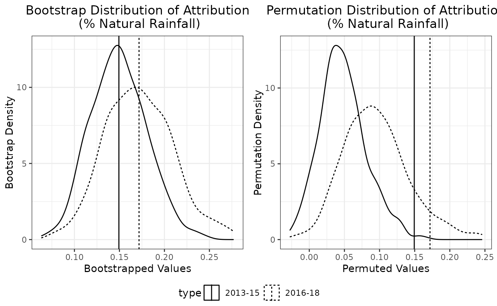

## Replicating the SATE Analysis of Chambers, Ranjbar, et al. (2022)

The package can also be used to replicate the SATE analysis of Chambers,
Ranjbar, et al. (2022), published in Journal of the Royal Statistical
Society Series A (Statistics in Society), “Weighting, informativeness
and causal inference, with an application to rainfall enhancement”.

In particular, the real data analysis presented in Section 5 can be
reproduced using the code below.

``` r

jrssa = rain_attr(
  data = oman,
  upwind_lmm_formula = LogRain ~ Year...2014 +  Year...2016 + Year...2017 + Year...2018 + Gauge.Elevation...1km + Gauge.Elevation...1km.1 + Steering.Wind.Speed + Total.Totals + PC2.Dry.Temperature + PC1.Relative.Humidity + PC1.Ground.Level.Pressure + (1|TrialDay),
  instr_pred_name = 'natural_pred',
  instr_pred_type = 'Unconditional',
  downwind_lmm_formula = LogRain ~ Year...2013 + Year...2014 +  Year...2016 + Year...2017 + Year...2018 + Gauge.Elevation...1km + Gauge.Elevation...1km.1 + natural_pred  + Target.H.01 + Target.H.02 + Target.H.03 + Target.H.04 + Target.H.05 + Target.H.06 + Target.H.07 + Target.H.08 + Target.H.09 + Target.H.10 + Gauge.Elevation...1km:Target.H.01 + Gauge.Elevation...1km:Target.H.02 + + Gauge.Elevation...1km.1:Target.H.01 + Gauge.Elevation...1km.1:Target.H.02 + (1|TrialDay),
  downwind_logistic_formula = (Rain.Gauge.Measurement > 0) ~ Year...2013 + Year...2014 + Year...2016 + Year...2017 + Year...2018 + Gauge.Elevation...1km + Gauge.Elevation...1km.1 + natural_pred  + Target.H.01 + Target.H.02 + Target.H.03 + Target.H.04 + Target.H.05 + Target.H.06 + Target.H.07 + Target.H.08 + Target.H.09 + Target.H.10 + Gauge.Elevation...1km:Target.H.01 + Gauge.Elevation...1km:Target.H.02 + Gauge.Elevation...1km.1:Target.H.01 + Gauge.Elevation...1km.1:Target.H.02,
  downwind_propensity_formula = (Gauge.Day.Type == 'Target') ~ Total.Totals + PC1.Dry.Temperature + PC1.Relative.Humidity + PC1.Ground.Level.Pressure,
  rain_col_name = 'Rain.Gauge.Measurement',
  upwind_subset = Gauge.Day.Type == 'Upwind' & Year!= 2013,
  downwind_subset = Gauge.Day.Type  %in% c('Target','Control'),
  downwind_target_subset = Gauge.Day.Type == 'Target',
  downwind_control_subset = Gauge.Day.Type == 'Control',
  positive_subset = Rain.Gauge.Measurement > 0,
  attr_type = 'ThoEtAl',
  x_downwind_name = c('Year...2013' , 'Year...2014' , 'Year...2016' , 'Year...2017' , 'Year...2018', 'Gauge.Elevation...1km', 'Gauge.Elevation...1km.1', 'natural_pred'),
  target_only = FALSE,
  bootstrap = TRUE,
  bootstrap_option = bootstrap_opt(B_bootstrap = 500,
                                   bootstrap_type = 'REB2',
                                   bootstrap_seed = 191,
                                   bootstrap_parallel = TRUE,
                                   bootstrap_parallel_num_worker = n_workers),
  permutation = TRUE,
  permutation_option = permutation_opt(B_permutation = 500,
                                       permutation_seed = 19321,
                                       permutation_parallel = TRUE,
                                       permutation_parallel_num_worker = n_workers)
  )
```

Table 1 is identical to:

``` r

summary(jrssa$all_fitted_models$downwind_propensity_fit)
#> 
#> Call:
#> glm(formula = downwind_propensity_formula, family = binomial, 
#>     data = downwind_positive_data)
#> 
#> Coefficients:
#>                            Estimate Std. Error z value Pr(>|z|)    
#> (Intercept)                0.753031   0.225356   3.342 0.000833 ***
#> Total.Totals              -0.016308   0.005033  -3.240 0.001194 ** 
#> PC1.Dry.Temperature        0.171612   0.040081   4.282 1.86e-05 ***
#> PC1.Relative.Humidity      0.109929   0.024680   4.454 8.42e-06 ***
#> PC1.Ground.Level.Pressure  0.114753   0.024076   4.766 1.88e-06 ***
#> ---
#> Signif. codes:  0 '***' 0.001 '**' 0.01 '*' 0.05 '.' 0.1 ' ' 1
#> 
#> (Dispersion parameter for binomial family taken to be 1)
#> 
#>     Null deviance: 5769.9  on 4167  degrees of freedom
#> Residual deviance: 5731.0  on 4163  degrees of freedom
#> AIC: 5741
#> 
#> Number of Fisher Scoring iterations: 4
```

Table 2 is identical to the summary table of the downwind (second-stage)
LMM:

``` r

summary(jrssa)
#> Summary of Two Stage LMM Rainfall Enhancement Analysis
#> ======================================================================
#> 
#> Attribution Results (Assuming Log-Rainfall being Modelled):
#>     Estimate  95% Bootstrap CI Bootstrap P-Val Permutation P-Val
#> apo    6.84% (3.2052%, 10.53%)            0***             0.01*
#> apl    7.34% (3.2402%, 11.76%)            0***             0.01*
#> ---
#> Signif. codes:  0 '***' 0.001 '**' 0.01 '*' 0.05 '.' 0.1 ' ' 1
#> 
#> SATE Results:
#>             Estimate  95% Bootstrap CI Bootstrap P-Val Permutation P-Val
#> sate.mb       0.1259  (0.0639, 0.1888)            0***             0.01*
#> sate.ipw      0.0740 (-0.0089, 0.1589)           0.04*              0.11
#> sate.ipw.l    0.1236   (0.0613, 0.186)            0***             0.01*
#> sate.ipw.ma   0.0733 (-0.0039, 0.1548)           0.04*              0.13
#> sate.aipw     0.0758  (-0.0056, 0.163)           0.04*               0.1
#> ---
#> Signif. codes:  0 '***' 0.001 '**' 0.01 '*' 0.05 '.' 0.1 ' ' 1
#> 
#> 
#> ======================================================================
#> 
#> Upwind (First Stage) LMM:
#> Formula:
#> LogRain ~ Year...2014 + Year...2016 + Year...2017 + Year...2018 + 
#>     Gauge.Elevation...1km + Gauge.Elevation...1km.1 + Steering.Wind.Speed + 
#>     Total.Totals + PC2.Dry.Temperature + PC1.Relative.Humidity + 
#>     PC1.Ground.Level.Pressure + (1 | TrialDay)
#> 
#> Data subset used: oman [ Gauge.Day.Type == "Upwind" & Year != 2013  &  Rain.Gauge.Measurement > 0 , ]
#> Number of observations: 1316, Number of groups: 237
#> 
#> Random effects:
#>    Groups        Name  Variance
#>  TrialDay (Intercept) 0.3616803
#>  Residual             1.5560159
#> 
#> Fixed effects:
#>                           Estimate Std. Error t value
#> (Intercept)                -2.0845     0.4633 -4.4987
#> Year...2014                -0.1249     0.1784 -0.7003
#> Year...2016                -0.2848     0.1809 -1.5745
#> Year...2017                -0.2850     0.1889 -1.5089
#> Year...2018                -0.3501     0.2146 -1.6310
#> Gauge.Elevation...1km       0.8657     0.1952  4.4351
#> Gauge.Elevation...1km.1     0.4223     0.0938  4.5024
#> Steering.Wind.Speed        -0.0615     0.0230 -2.6746
#> Total.Totals                0.0421     0.0095  4.4317
#> PC2.Dry.Temperature         0.1190     0.0545  2.1856
#> PC1.Relative.Humidity       0.1634     0.0227  7.1913
#> PC1.Ground.Level.Pressure  -0.0411     0.0207 -1.9838
#> 
#> ======================================================================
#> 
#> Downwind (Second Stage) LMM:
#> Formula:
#> LogRain ~ Year...2013 + Year...2014 + Year...2016 + Year...2017 + 
#>     Year...2018 + Gauge.Elevation...1km + Gauge.Elevation...1km.1 + 
#>     natural_pred + Target.H.01 + Target.H.02 + Target.H.03 + 
#>     Target.H.04 + Target.H.05 + Target.H.06 + Target.H.07 + Target.H.08 + 
#>     Target.H.09 + Target.H.10 + Gauge.Elevation...1km:Target.H.01 + 
#>     Gauge.Elevation...1km:Target.H.02 + +Gauge.Elevation...1km.1:Target.H.01 + 
#>     Gauge.Elevation...1km.1:Target.H.02 + (1 | TrialDay)
#> 
#> Data subset used: oman [ Gauge.Day.Type %in% c("Target", "Control")  &  Rain.Gauge.Measurement > 0 , ]
#> Number of observations: 4168, Number of groups: 488
#> 
#> Random effects:
#>    Groups        Name  Variance
#>  TrialDay (Intercept) 0.2251801
#>  Residual             1.8529757
#> 
#> Fixed effects:
#>                                     Estimate Std. Error t value
#> (Intercept)                           0.0765     0.1208  0.6332
#> Year...2013                           0.4058     0.1132  3.5834
#> Year...2014                           0.3357     0.1064  3.1554
#> Year...2016                           0.2586     0.1153  2.2430
#> Year...2017                           0.0923     0.1192  0.7743
#> Year...2018                           0.0405     0.1463  0.2770
#> Gauge.Elevation...1km                -0.1996     0.1640 -1.2174
#> Gauge.Elevation...1km.1              -0.0962     0.0709 -1.3577
#> natural_pred                          0.9451     0.0591 15.9968
#> Target.H.01                           0.4807     0.2470  1.9463
#> Target.H.02                           0.8403     0.2930  2.8680
#> Target.H.03                           0.2411     0.0922  2.6142
#> Target.H.04                          -0.1140     0.0888 -1.2837
#> Target.H.05                           0.4992     0.1317  3.7904
#> Target.H.06                          -0.1364     0.1489 -0.9164
#> Target.H.07                           0.3355     0.1879  1.7859
#> Target.H.08                           0.1315     0.1284  1.0239
#> Target.H.09                           0.7113     0.3065  2.3206
#> Target.H.10                           0.1955     0.1700  1.1499
#> Gauge.Elevation...1km:Target.H.01    -0.4878     0.3634 -1.3423
#> Gauge.Elevation...1km:Target.H.02    -1.2718     0.4685 -2.7147
#> Gauge.Elevation...1km.1:Target.H.01  -0.1627     0.1585 -1.0261
#> Gauge.Elevation...1km.1:Target.H.02  -0.4583     0.1718 -2.6683
```

Table 3 is identical to the

``` r

downwind_varcomp = varcomp(jrssa)['downwind_lmm',]

cbind(
  'Var comp' = downwind_varcomp, 
  'Pct of total' = downwind_varcomp/sum(downwind_varcomp) * 100
)
#>           Var comp Pct of total
#> TrialDay 0.2251801     10.83558
#> Residual 1.8529757     89.16442
```

Table 4 is identical to

``` r

#Target model
summary(jrssa$all_fitted_models$downwind_positive_target_lmm_fit)$coef
#>                            Estimate Std. Error   t value
#> (Intercept)              0.43918516 0.14679267  2.991874
#> Year...2013              0.38868713 0.14498460  2.680886
#> Year...2014              0.45385542 0.13811842  3.285988
#> Year...2016              0.34712941 0.14762617  2.351408
#> Year...2017              0.22160137 0.14688432  1.508680
#> Year...2018              0.08477673 0.18455522  0.459357
#> Gauge.Elevation...1km   -0.69363326 0.19798956 -3.503383
#> Gauge.Elevation...1km.1 -0.29639368 0.08256077 -3.590006
#> natural_pred             0.94174156 0.07587026 12.412526

#Control model
summary(jrssa$all_fitted_models$downwind_positive_control_lmm_fit)$coef
#>                            Estimate Std. Error    t value
#> (Intercept)              0.02533697 0.14694075  0.1724298
#> Year...2013              0.49063790 0.14550146  3.3720479
#> Year...2014              0.24750308 0.13488516  1.8349170
#> Year...2016              0.27650431 0.14673274  1.8844077
#> Year...2017              0.09564666 0.15260033  0.6267789
#> Year...2018              0.09708881 0.19122863  0.5077106
#> Gauge.Elevation...1km   -0.06618146 0.20372709 -0.3248535
#> Gauge.Elevation...1km.1 -0.06163347 0.08778100 -0.7021277
#> natural_pred             0.90292193 0.07879799 11.4586928
```

Table 5 is identical to:

``` r

downwind_target_varcomp = varcomp(jrssa)['downwind_target_lmm',]
downwind_control_varcomp = varcomp(jrssa)['downwind_control_lmm',]

#Target model
cbind(
  'Var comp' = downwind_target_varcomp, 
  'Pct of total' = downwind_target_varcomp/sum(downwind_target_varcomp) * 100
)
#>           Var comp Pct of total
#> TrialDay 0.2965226     13.96288
#> Residual 1.8271261     86.03712

#Control model
cbind(
  'Var comp' = downwind_control_varcomp, 
  'Pct of total' = downwind_control_varcomp/sum(downwind_control_varcomp) * 100
)
#>          Var comp Pct of total
#> TrialDay 0.281269     13.65164
#> Residual 1.779063     86.34836
```

The following attempts to replicate the lower panel of Table 6
corresponding to `LogRain`. Firstly, the point estimate of SATEs in the
first row are exactly the same as those in Table 6, except for AIPW due
to the presence of a coding error in the original implemention which has
now been corrected in this package. The remaining rows are close to, but
not exactly the same as, those in Table 6 due to the inherent randomness
of the bootstrap procedure and a smaller number of bootstrap replicates
used here (`bootstrap_opt(B_bootstrap = 500)`) to reduce computational
time.

``` r

table6_jrssa_lograin = rbind(
  c(jrssa$hatsate$sate.ipw, jrssa$hatsate$sate.ipw.ma, jrssa$hatsate$sate.aipw, jrssa$hatsate$sate.ipw.l, jrssa$hatsate$sate.mb),
  apply(jrssa$bootstrap_result$hatsate[,c('sate.ipw','sate.ipw.ma','sate.aipw','sate.ipw.l','sate.mb')], 2, function(x){
  c(sd(x), mean(x < 0), quantile(x, probs = c(0.001, 0.005, 0.025, 0.5, 0.975, 0.995, 0.999)) )
})
)

rownames(table6_jrssa_lograin) = c('Estimate', 'Std Dev' , 'Pr < 0', '0.1%', '0.5%', '2.5%', '50%', '97.5%', '99.5%', '99.9%')
colnames(table6_jrssa_lograin) = c('IPW', 'IPW-MA', 'AIPW', 'IPW-L', 'MB')

table6_jrssa_lograin
#>                   IPW       IPW-MA         AIPW      IPW-L         MB
#> Estimate  0.074018677  0.073275639  0.075839429 0.12362512 0.12594039
#> Std Dev   0.042266109  0.041350970  0.042715863 0.03208145 0.03210279
#> Pr < 0    0.040000000  0.038000000  0.038000000 0.00000000 0.00000000
#> 0.1%     -0.048534736 -0.040442435 -0.049354912 0.02432771 0.02662306
#> 0.5%     -0.030866087 -0.025504676 -0.030503169 0.04755856 0.04973812
#> 2.5%     -0.008860096 -0.003942739 -0.005590821 0.06132309 0.06388347
#> 50%       0.073431789  0.074376326  0.074798596 0.12429946 0.12635743
#> 97.5%     0.158946827  0.154820201  0.162956335 0.18598148 0.18875737
#> 99.5%     0.193719116  0.183986697  0.196055339 0.19986492 0.20251495
#> 99.9%     0.216288800  0.209864338  0.217144181 0.20163745 0.20482817
```

The following attempts to replicate the plot associated with `LogRain`
in Figure 5:

``` r

bootstrap_df_jrssa = rbind(
  data.frame(
    sate = jrssa$bootstrap_result$hatsate[,'sate.ipw'],
    type = 'IPW'
  ),
  data.frame(
    sate = jrssa$bootstrap_result$hatsate[,'sate.ipw.ma'],
    type = 'IPW-MA'
  ),
  data.frame(
    sate = jrssa$bootstrap_result$hatsate[,'sate.ipw.l'],
    type = 'IPW-L'
  )
)

ori_df_jrssa = rbind(
  data.frame(
    sate = jrssa$hatsate$sate.ipw,
    type = 'IPW'
  ),
  data.frame(
    sate = jrssa$hatsate$sate.ipw.ma,
    type = 'IPW-MA'
  ),
  data.frame(
    sate = jrssa$hatsate$sate.ipw.l,
    type = 'IPW-L'
  )
)

fig5_jrssa_lograin = ggplot2::ggplot() +
      ggplot2::geom_density(data = bootstrap_df_jrssa, ggplot2::aes(x = sate, linetype = type)) +
      ggplot2::geom_vline(data = ori_df_jrssa, ggplot2::aes(xintercept = sate, linetype = type)) +
      ggplot2::ggtitle('Bootstrap Distribution of SATE') +
      ggplot2::xlab('Bootstrapped Values') +
      ggplot2::ylab('Bootstrap Density') +
      ggplot2::theme_bw() + ggplot2::theme(plot.title = ggplot2::element_text(hjust = 0.5), legend.position = 'bottom')

fig5_jrssa_lograin
```

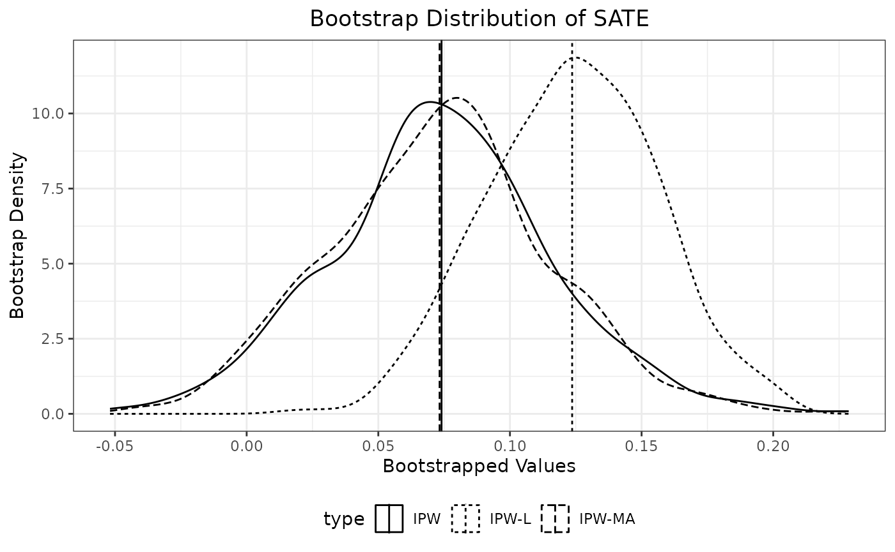

The following attempts to replicate Table 7, with some differences due
to the inherent randomness of permutation procedure and the smaller
number of permutation replicates
(`permutation_opt(B_permutation = 500)`), as well as a coding error in
the original implementation of the AIPW estimator which has been
corrected in this package:

``` r

table7_jrssa_lograin = jrssa$permutation_p_value_result$hatsate[c('sate.ipw','sate.ipw.ma','sate.aipw','sate.ipw.l','sate.mb')]
names(table7_jrssa_lograin) = c('IPW', 'IPW-MA', 'AIPW', 'IPW-L', 'MB')
table7_jrssa_lograin
#>    IPW IPW-MA   AIPW  IPW-L     MB 
#>  0.114  0.134  0.100  0.012  0.012
```

The following attempts to replicate the plot associated with `LogRain`
in Figure 6:

``` r

permutation_df_jrssa = rbind(
  data.frame(
    sate = jrssa$permutation_result$hatsate[,'sate.ipw'],
    type = 'IPW'
  ),
  data.frame(
    sate = jrssa$permutation_result$hatsate[,'sate.ipw.ma'],
    type = 'IPW-MA'
  ),
  data.frame(
    sate = jrssa$permutation_result$hatsate[,'sate.ipw.l'],
    type = 'IPW-L'
  )
)

ori_df_jrssa = rbind(
  data.frame(
    sate = jrssa$hatsate$sate.ipw,
    type = 'IPW'
  ),
  data.frame(
    sate = jrssa$hatsate$sate.ipw.ma,
    type = 'IPW-MA'
  ),
  data.frame(
    sate = jrssa$hatsate$sate.ipw.l,
    type = 'IPW-L'
  )
)

fig6_jrssa_lograin = ggplot2::ggplot() +
      ggplot2::geom_density(data = permutation_df_jrssa, ggplot2::aes(x = sate, linetype = type)) +
      ggplot2::geom_vline(data = ori_df_jrssa, ggplot2::aes(xintercept = sate, linetype = type)) +
      ggplot2::ggtitle('Permutation Distribution of SATE') +
      ggplot2::xlab('Permuted Values') +
      ggplot2::ylab('Permutation Density') +
      ggplot2::theme_bw() + ggplot2::theme(plot.title = ggplot2::element_text(hjust = 0.5), legend.position = 'bottom')

fig6_jrssa_lograin
```

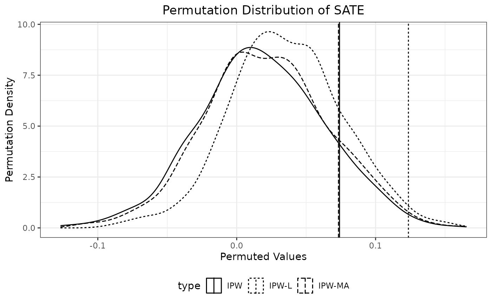

## References

Chambers, Ray, Stephen Beare, Scott Peak, and Mohammed Al-Kalbani. 2022.
“Nudging a Pseudo-Science Towards a Science—the Role of Statistics in a
Rainfall Enhancement Trial in Oman.” *International Statistical Review*
90: 346–73.

Chambers, Ray, and Hukum Chandra. 2013. “A Random Effect Block Bootstrap
for Clustered Data.” *Journal of Computational and Graphical Statistics*
22: 452–70.

Chambers, Ray, S. Ranjbar, Nicola Salvati, and Barbara Pacini. 2022.
“Weighting, Informativeness and Causal Inference, with an Application to
Rainfall Enhancement.” *Journal of the Royal Statistical Society: Series
A (Statistics in Society)* 185: 1584–612.

Tho, Zhi Yang, Ray Chambers, and Alan H. Welsh. 2025. *Adjusted Random
Effect Block Bootstraps for Highly Unbalanced Clustered Data*.
<https://arxiv.org/abs/2510.07770>.

Tho, Zhi Yang, Ray Chambers, and Alan H. Welsh. 2026. “Bias-Adjusted
Attribution Estimation for Rainfall Enhancement Trials.” Unpublished
manuscript.
