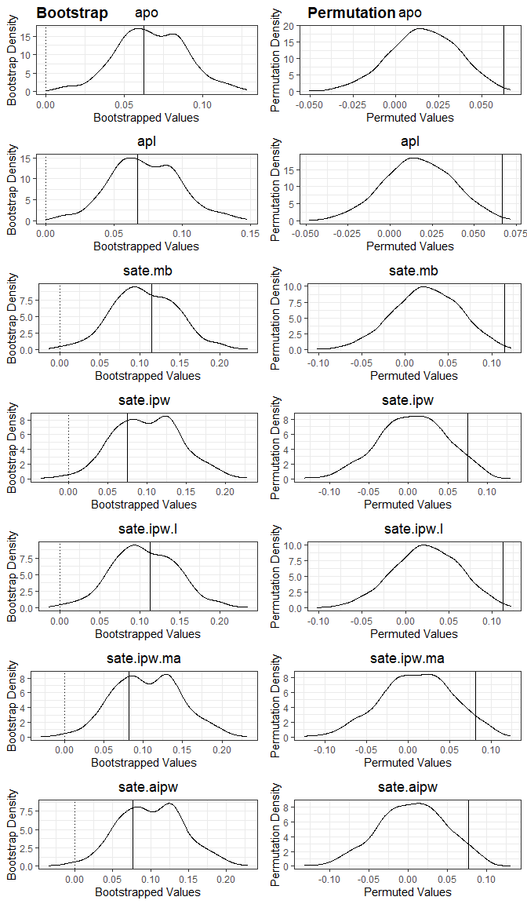

# RainAttr

`RainAttr` provide tools for estimation and inference of attribution and
sample average treatment effect in rainfall enhancement trials, based on
the two-stage linear mixed model approach employed by [Chambers et
al. (2022)](#references). It also provides tools for exploratory
analysis of rainfall enhancement trial data.

## Installation

You can install the development version of RainAttr from
[GitHub](https://github.com/) with:

``` r

# install.packages("remotes")
remotes::install_github("Zy1225/RainAttr")
```

## Example

This basic example shows how to use the package for estimation,
bootstrap inference, and permutation inference.

``` r

library(RainAttr)

result = rain_attr(
  #gauge-day level trial data
  data = oman,
  
  #LMM formula fitted to the upwind (first-stage) observations
  upwind_lmm_formula = LogRain ~  Gauge.Elevation + Steering.Wind.Speed + Total.Totals + PC2.Dry.Temperature + PC1.Relative.Humidity + PC1.Ground.Level.Pressure + (1|TrialDay),
  
  #Variable name for storing instrumental prediction from upwind (first-stage) LMM
  instr_pred_name = 'natural_pred',
  
  #Types of instrumental prediction: 'Unconditional' or 'Conditional'
  instr_pred_type = 'Conditional',
  
  #LMM formula fitted to the downwind (second-stage) observations
  downwind_lmm_formula = LogRain - natural_pred ~ Gauge.Elevation  + Target.H.01 + Target.H.02 + Target.H.03 + Target.H.04 + Target.H.05 + Target.H.06 + Target.H.07 + Target.H.08 + Target.H.09 + Target.H.10 + Gauge.Elevation:Target.H.01 + Gauge.Elevation:Target.H.02 + (1|TrialDay),
  
  #Formula for fitting a logistic regression model to the indicator of rainfall event (used for bootstrapping of rainfall events when bootstrap_opt(bootstrap_zero) = TRUE)
  downwind_logistic_formula = (Rain.Gauge.Measurement > 0) ~ Gauge.Elevation + natural_pred  + Target.H.01 + Target.H.02 + Target.H.03 + Target.H.04 + Target.H.05 + Target.H.06 + Target.H.07 + Target.H.08 + Target.H.09 + Target.H.10 + Gauge.Elevation:Target.H.01 + Gauge.Elevation:Target.H.02,
  
  #Formula for fitting the propensity score model to downwind observations, where responses are indicators of whether each downwind observations is a 'Target'
  downwind_propensity_formula = (Gauge.Day.Type == 'Target') ~ Total.Totals + PC1.Dry.Temperature + PC1.Relative.Humidity + PC1.Ground.Level.Pressure,
  
  #Specify the column in input data that contains the raw rainfall
  rain_col_name = 'Rain.Gauge.Measurement',
  
  #Logical expression identifying subset of observations to which upwind_lmm_formula is fitted
  upwind_subset = Gauge.Day.Type == 'Upwind',

  #Logical expression identifying subset of observations to which downwind_lmm_formula is fitted
  downwind_subset = Gauge.Day.Type  %in% c('Target','Control'),

  #Logical expression identifying subset of observations of those that are 'Target'
  downwind_target_subset = Gauge.Day.Type == 'Target',

  #Logical expression identifying subset of observations of those that are 'Control'
  downwind_control_subset = Gauge.Day.Type == 'Control',

  #Logical expression identifying subset of observations with rainfall event
  positive_subset = Rain.Gauge.Measurement > 0,
  
  #Types of correction (for back-transformation bias) used for computing the attribution estimate: 'ChambersEtAl', 'ChambersEtAl_No_Winsorize', 'ThoEtAl', or 'No'
  attr_type = 'ThoEtAl',

  #Vector of variable names in downwind_lmm_formula to identify non-ionizer related covariates, whose effects are not included in the calculation of attribution and SATE
  x_downwind_name = c('Gauge.Elevation'),
  
  #Indicator for whether to perform bootstrap inference on attribution and SATE
  bootstrap = TRUE,

  #Specification of various option for bootstrap, e.g., bootstrap_opt(bootstrap_type = 'PREB1'), currently support bootstrap_type = 'PREB0', 'PREB1', 'PREB2', 'REB0', 'REB1', 'REB2', 'MREB1'
  bootstrap_option = bootstrap_opt(B_bootstrap = 500, 
                                   bootstrap_seed = 123, 
                                   bootstrap_parallel = TRUE,
                                   bootstrap_parallel_num_worker = 6),

  #Indicator for whether to perform permutation inference on attribution and SATE
  permutation = TRUE,

  #Specification of various option for permutation,  e.g., whether to permute the operating states between ionizers, between days, between gaugedays
  permutation_option = permutation_opt(B_permutation = 500,
                                       permutation_seed = 999,
                                       permutation_parallel = TRUE,
                                       permutation_parallel_num_worker = 6)
  )
```

The main function, `rain_attr`, returns an S3 object that supports a
range of common S3 methods, including:

``` r

summary(result)
#> Summary of Two Stage LMM Rainfall Enhancement Analysis
#> ======================================================================
#> 
#> Attribution Results (Assuming Log-Rainfall being Modelled):
#>     Estimate  95% Bootstrap CI Bootstrap P-Val Permutation P-Val
#> apo    6.27% (2.3799%, 11.21%)            0***              0***
#> apl    6.69%  (2.438%, 12.63%)            0***              0***
#> ---
#> Signif. codes:  0 '***' 0.001 '**' 0.01 '*' 0.05 '.' 0.1 ' ' 1
#> 
#> SATE Results:
#>             Estimate 95% Bootstrap CI Bootstrap P-Val Permutation P-Val
#> sate.mb       0.1153 (0.0259, 0.1899)            0***              0***
#> sate.ipw      0.0751  (0.022, 0.1861)           0.01*             0.05.
#> sate.ipw.l    0.1132 (0.0263, 0.1898)            0***              0***
#> sate.ipw.ma   0.0813 (0.0278, 0.1895)           0.01*             0.05.
#> sate.aipw     0.0771 (0.0243, 0.1877)           0.01*             0.05.
#> ---
#> Signif. codes:  0 '***' 0.001 '**' 0.01 '*' 0.05 '.' 0.1 ' ' 1
#> 
#> 
#> ======================================================================
#> 
#> Upwind (First Stage) LMM:
#> Formula:
#> LogRain ~ Gauge.Elevation + Steering.Wind.Speed + Total.Totals + 
#>     PC2.Dry.Temperature + PC1.Relative.Humidity + PC1.Ground.Level.Pressure + 
#>     (1 | TrialDay)
#> 
#> Data subset used: oman [ Gauge.Day.Type == "Upwind"  &  Rain.Gauge.Measurement > 0 , ]
#> Number of observations: 1545, Number of groups: 292
#> 
#> Random effects:
#>    Groups        Name  Variance
#>  TrialDay (Intercept) 0.4158771
#>  Residual             1.6003327
#> 
#> Fixed effects:
#>                           Estimate Std. Error t value
#> (Intercept)                -1.4397     0.3988 -3.6104
#> Gauge.Elevation             0.4340     0.0740  5.8631
#> Steering.Wind.Speed        -0.0964     0.0204 -4.7277
#> Total.Totals                0.0327     0.0083  3.9204
#> PC2.Dry.Temperature         0.1448     0.0527  2.7454
#> PC1.Relative.Humidity       0.1779     0.0223  7.9681
#> PC1.Ground.Level.Pressure  -0.0523     0.0201 -2.6041
#> 
#> ======================================================================
#> 
#> Downwind (Second Stage) LMM:
#> Formula:
#> LogRain - natural_pred ~ Gauge.Elevation + Target.H.01 + Target.H.02 + 
#>     Target.H.03 + Target.H.04 + Target.H.05 + Target.H.06 + Target.H.07 + 
#>     Target.H.08 + Target.H.09 + Target.H.10 + Gauge.Elevation:Target.H.01 + 
#>     Gauge.Elevation:Target.H.02 + (1 | TrialDay)
#> 
#> Data subset used: oman [ Gauge.Day.Type %in% c("Target", "Control")  &  Rain.Gauge.Measurement > 0 , ]
#> Number of observations: 4168, Number of groups: 488
#> 
#> Random effects:
#>    Groups        Name  Variance
#>  TrialDay (Intercept) 0.3001795
#>  Residual             1.8492958
#> 
#> Fixed effects:
#>                             Estimate Std. Error t value
#> (Intercept)                   0.3078     0.0626  4.9154
#> Gauge.Elevation              -0.1958     0.0606 -3.2293
#> Target.H.01                   0.3157     0.1362  2.3172
#> Target.H.02                   0.2398     0.1237  1.9389
#> Target.H.03                   0.2368     0.0925  2.5604
#> Target.H.04                  -0.1401     0.0890 -1.5738
#> Target.H.05                   0.4180     0.1319  3.1685
#> Target.H.06                  -0.2002     0.1493 -1.3413
#> Target.H.07                   0.2309     0.1876  1.2312
#> Target.H.08                   0.0786     0.1276  0.6163
#> Target.H.09                   0.5648     0.3062  1.8448
#> Target.H.10                   0.0527     0.1677  0.3141
#> Gauge.Elevation:Target.H.01  -0.1335     0.1437 -0.9287
#> Gauge.Elevation:Target.H.02  -0.1978     0.1196 -1.6539
```

and

``` r

plot(result)
```



## Documentation

Full documentation, function references, and worked examples are
available on the [package website](https://zy1225.github.io/RainAttr/).

## Citation

To cite `RainAttr`, run:

``` r

citation("RainAttr")
#> Warning in citation("RainAttr"): could not determine year for 'RainAttr' from
#> package DESCRIPTION file
#> To cite package 'RainAttr' in publications use:
#> 
#>   Tho Z, Chambers R, Welsh A (????). _RainAttr: Attribution and Sample
#>   Average Treatment Effect for Rainfall Enhancement Trial Data_. R
#>   package version 0.0.0.9000, <https://github.com/Zy1225/RainAttr>.
#> 
#> A BibTeX entry for LaTeX users is
#> 
#>   @Manual{,
#>     title = {RainAttr: Attribution and Sample Average Treatment Effect for Rainfall Enhancement Trial Data},
#>     author = {Zhi Yang Tho and Raymond Chambers and A. H. Welsh},
#>     note = {R package version 0.0.0.9000},
#>     url = {https://github.com/Zy1225/RainAttr},
#>   }
```

## References

Chambers, R., Ranjbar, S., Salvati, N., and Pacini, B. (2022).
Weighting, informativeness and causal inference, with an application to
rainfall enhancement. *Journal of the Royal Statistical Society: Series
A (Statistics in Society)*, **185**, 1584–1612.
